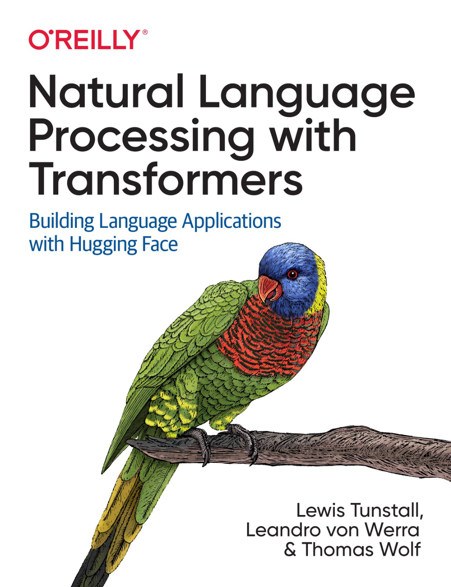

# Natural Language Processing with Transformers: Building Language Applications with Hugging Face
## 用Transformers处理自然语言：创建基于Hugging Face的文本内容处理程序
### Lewis Tunstall, Leandro von Werra, and Thomas Wolf  （Hugging face Transformer库作者 , 详情：[作者介绍](authors.md)）
###  《Hands-on Machine Learning with Scikit-Learn and TensorFlow》作者 Aurélien Géron 撰写[前言](foreword.md)。

### [序](preface.md)
### 第1章 ["Hello，Transformers"](chapter1.md)
介绍了Transformers并将其置于背景之中。 它还提供了一个关于 "Hugging face"生态系统的介绍。
###  第2章 [文本分类](chapter2.md)
重点是情感分析的任务（一个常见的文本分类问题），并介绍了Trainer API。
###  第3章 [Transformers架构剖析](chapter3.md)
更深入地探讨Transformer架构，为后面的章节做准备。
###  第4章 [多语言命名实体识别](chapter4.md)
侧重于识别多语言文本中的实体的任务（一个标记分类问题）。
### 第5章 [文本生成](chapter5.md)
探讨了Transformers模型生成文本的能力，并介绍了解码策略和度量。
### 第6章 [文本摘要](chapter6.md)
挖掘了文本摘要的复杂的序列-序列任务，并探讨了用于这一任务的指标。
###  第7章  [问答系统](chapter7.md)
主要是建立一个基于评论的问题回答系统，并介绍了用Haystack进行检索的情况。
### 第8章 [优化Transformers性能](chapter8.md)
重点是模型性能。 我们将研究意图检测的任务（一种序列分类问题），并探索知识蒸馏、量化和剪枝等技术。
### 第9章 [处理少标签或无标签任务](chapter9.md)
探讨了在没有大量标签数据的情况下提高模型性能的方法。 我们将建立一个GitHub问题标注器，并探索诸如零样本分类和数据增强等技术。
### 第10章 [从零开始训练Transformers](chapter10.md)
告诉你如何从零开始建立和训练一个用于自动进行Python源代码补全的模型。 我们将研究流式数据集和大规模训练，并建立我们自己的标记器（tokenizer)。
### 第11章 [未来发展方向](chapter11.md)
探讨了Transformers所面临的挑战和该研究领域的一些令人兴奋的新方向。
### [致谢](thanks.md)