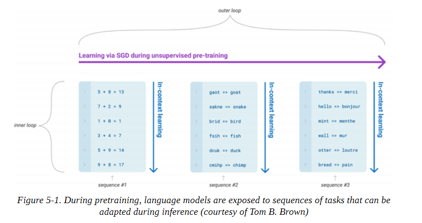
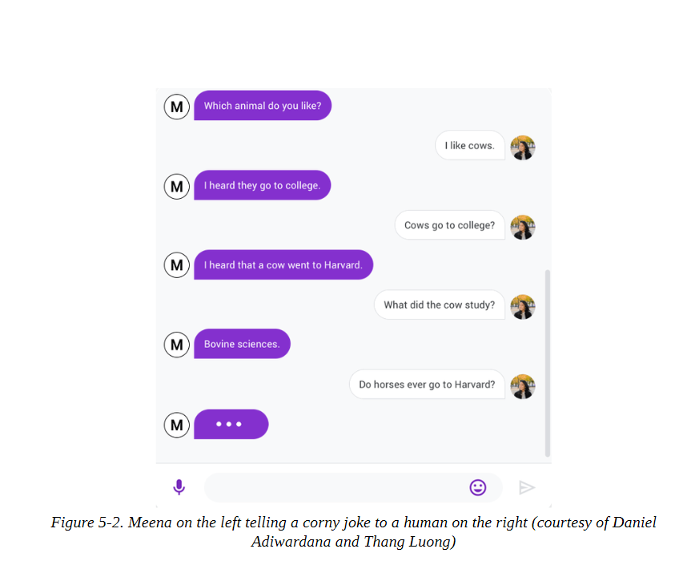
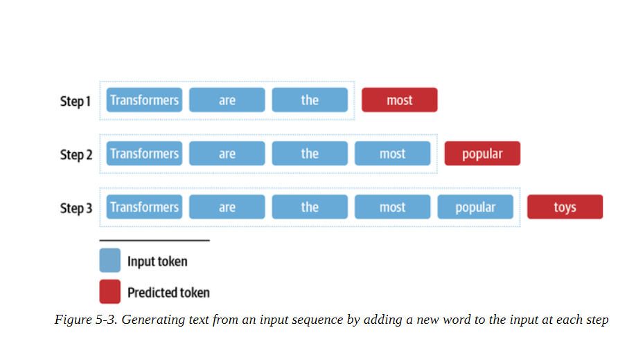
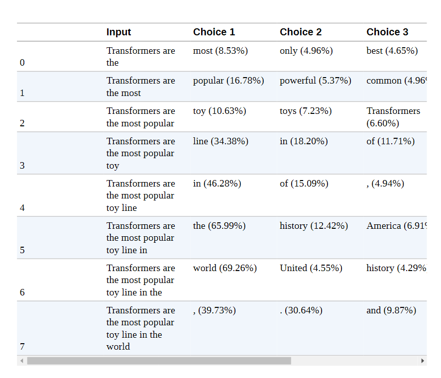
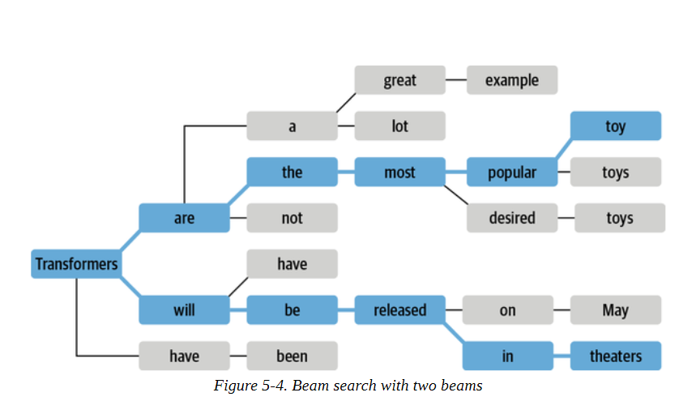
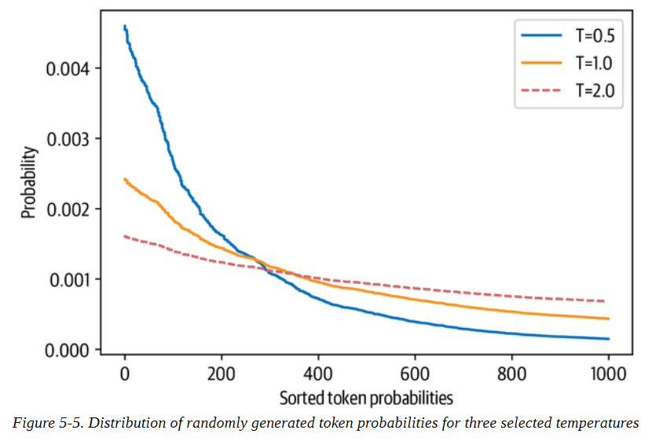
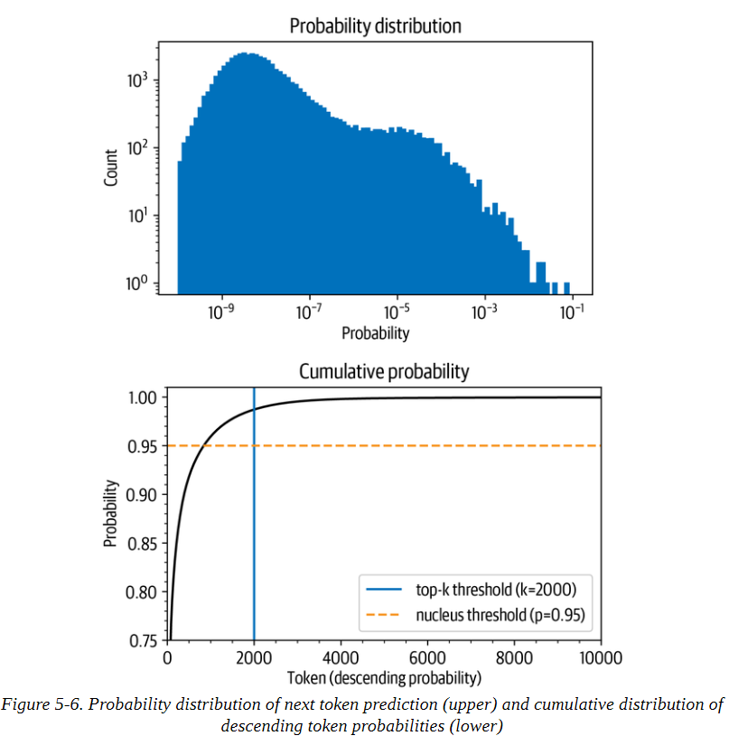

# 第5章  文本生成

基于Transformers的语言模型最不可思议的特点之一是它们能够生成与人类所写的文本几乎没有区别的文本。一个著名的例子是OpenAI的GPT-2，它在给出以下提示时:

*In a shocking finding, scientist discovered a herd of unicorns living in a remote, previously unexplored valley, in the Andes Mountains. Even more surprising to the researchers was the fact that the unicorns spoke perfect English.*


能够生成一篇关于独角兽的新闻：

*The scientist named the population, after their distinctive horn, Ovid’s Unicorn. These four-horned, silver-white unicorns were previously unknown to science. Now, after almost two centuries, the mystery of what sparked this odd phenomenon is finally solved. Dr. Jorge Pérez, an evolutionary biologist from the University of La Paz, and several companions, were exploring the Andes Mountains when they found a small valley, with no other animals or humans. Pérez noticed that the valley had what appeared to be a natural fountain, surrounded by two peaks of rock and silver snow. Pérez and the others then ventured further into the valley. “By the time we reached the top of one peak, the water looked blue, with some crystals on top,” said Pérez. Pérez and his friends were astonished to see the unicorn herd. These creatures could be seen from the air without having to move too much to see them—they were so close they could touch their horns. While examining these bizarre creatures the scientists discovered that the creatures also spoke some fairly regular English ...*

这个例子之所以如此引人注目，是因为它是在没有任何明确监督的情况下产生的! 通过简单地学习预测数以百万计的网页文本中的下一个词，GPT-2和它更强大的后代，如GPT-3，能够获得一套广泛的技能和模式识别能力。能被不同类型的输入提示激活的能力。图5-1显示了语言模型在预训练期间有时会接触到一些任务序列，在这些任务中，它们需要仅仅根据上下文来预测下面的标记，如加法、解词和翻译。这使得它们在微调期间或（如果模型足够大）在推理时间有效地转移这些知识。这些任务不是提前选择的，而是在用于训练十亿参数语言模型的巨大语料库中自然出现的。



Transformers生成现实文本的能力导致了多样化的应用，如InferKit、Write With Transformer、AI Dungeon，以及像谷歌的Meena这样的对话代理，它甚至可以讲出老套的笑话，如图5-2所示!



在本章中，我们将使用GPT-2来说明语言模型的文本生成方式，并探讨不同的解码策略如何影响生成的文本。

## 产生连贯性文本的挑战

在本书中，到目前为止，我们一直专注于通过预训练和监督微调的组合来处理NLP任务。正如我们所看到的，对于像序列或标记分类这样的特定任务，产生预测是相当直接的；模型产生一些对数，我们或者取最大值来获得预测的类别，或者应用softmax函数来获得每个类别的预测概率。相比之下，将模型的概率输出转换为文本需要一种解码方法，这就引入了一些文本生成所特有的挑战：

- 解码是反复进行的，因此比简单地将输入通过模型的前向传递一次涉及到更多的计算。
- 生成文本的质量和多样性取决于解码方法和相关超参数的选择。

为了理解这个解码过程是如何进行的，让我们先来看看GPT-2是如何进行预训练并随后应用于生成文本的。

像其他自回归或因果语言模型一样，GPT-2被预训练来估计文本中出现的标记序列y = y1, y2, ... yt的概率P（y|x），给定一些初始提示或语境序列x = x1, x2, ... xk。由于获得足够的训练数据来直接估计P(y|x)是不切实际的，所以通常使用概率链规则来将其分解为条件概率的乘积。


其中 y<t 是序列y1, ..., yt-1的速记符号。正是从这些条件概率中，我们获得了这样的直觉：自回归语言建模相当于在一个句子中给定前面的词来预测每个词；这正是前面方程中右边的概率所描述的。请注意，这个预训练目标与BERT的预训练目标完全不同，BERT利用过去和未来的语境来预测一个被掩盖的标记。

现在你可能已经猜到我们如何调整这个下一个标记的预测任务，以生成任意长度的文本序列。如图5-3所示，我们从 "变形金刚是 "这样的提示开始，用模型来预测下一个标记。一旦我们确定了下一个标记，我们就把它附加到提示上，然后用新的输入序列来生成另一个标记。我们这样做，直到我们达到一个特殊的序列结束符号或预先定义的最大长度。




**注意事项**

由于输出序列以输入提示的选择为条件，这种类型的文本生成通常被称为条件性文本生成。


这个过程的核心是一个解码方法，决定在每个时间段选择哪个标记。由于语言模型头在每个步骤中对词汇中的每个标记产生一个logit zt,i，我们可以通过采取softmax得到下一个可能的标记wi的概率分布。


大多数解码方法的目标是通过挑选一个ˆy来搜索最可能的整体序列，从而使之成为。


直接找到ˆy将涉及到用语言模型评估每一个可能的序列。由于不存在一种能在合理时间内完成这一工作的算法，我们只能依靠近似值来代替。在本章中，我们将探索其中的一些近似方法，并逐步建立起 逐步建立起更智能、更复杂的算法，以用于生成高质量的文本。

## 贪婪搜索解码

从模型的连续输出中获得离散标记的最简单的解码方法是贪婪地选择每个时间点上概率最大的标记：


为了了解贪婪搜索是如何工作的，让我们先用语言建模头加载15亿参数版本的GPT-2：

```py
import torch 
from transformers import AutoTokenizer, AutoModelForCausalLM 
device = "cuda" if torch.cuda.is_available() else "cpu" 
model_name = "gpt2-xl" 
tokenizer = AutoTokenizer.from_pretrained(model_name) 
model = AutoModelForCausalLM.from_pretrained(model_name).to(device)

```

现在让我们来生成一些文本! 尽管Transformers为GPT-2这样的自回归模型提供了一个generate()函数，但我们将自己实现这个解码方法，看看引擎盖下发生了什么。为了热身，我们将采取图5-3所示的相同的迭代方法：我们将使用 "变形金刚是 "作为输入提示，并运行八个时间段的解码。在每个时间步骤中，我们为提示中的最后一个符号挑选出模型的对数，并用softmax包起来，得到一个概率分布。然后，我们挑选出概率最高的下一个符号，将其添加到输入序列中，并再次运行该过程。下面的代码完成了这项工作，并且还在每个时间段存储了五个最有可能的标记，这样我们就可以直观地看到备选方案：

```py
import pandas as pd
input_txt = "Transformers are the" 
input_ids = tokenizer(input_txt, return_tensors="pt")["input_ids"].to(device) 
iterations = [] 
n_steps = 8 
choices_per_step = 5
with torch.no_grad(): 
	for _ in range(n_steps): 
		iteration = dict() 
		iteration["Input"] = tokenizer.decode(input_ids[0]) 
		output = model(input_ids=input_ids) 
		# Select logits of the first batch and the last token and apply softmax 			
		next_token_logits = output.logits[0, -1, :]
		next_token_probs = torch.softmax(next_token_logits, dim=-1) 
		sorted_ids = torch.argsort(next_token_probs, dim=-1, descending=True) 
		# Store tokens with highest probabilities 
		for choice_idx in range(choices_per_step): 
			token_id = sorted_ids[choice_idx] 
			token_prob = next_token_probs[token_id].cpu().numpy() 
			token_choice = ( f"{tokenizer.decode(token_id)} ({100 * token_prob:.2f}%)" ) 
			iteration[f"Choice {choice_idx+1}"] = token_choice 
			# Append predicted next token to input 
			input_ids = torch.cat([input_ids, sorted_ids[None, 0, None]], dim=-1) 
			iterations.append(iteration) pd.DataFrame(iterations)
pd.DataFrame(iterations)

```



通过这种简单的方法，我们能够生成 "变形金刚是世界上最受欢迎的玩具系列 "的句子。有趣的是，这表明GPT-2已经内化了一些关于变形金刚媒体系列的知识，它是由两家玩具公司（Hasbro和Takara Tomy）创造的。我们还可以看到每一步都有其他可能的延续，这显示了文本生成的迭代性质。与序列分类等其他任务不同的是，在序列分类中，单一的前向传递就足以产生预测，而在文本生成中，我们需要一次一次地对输出标记进行解码。

实现贪婪搜索并不难，但我们要使用Transformers内置的generate()函数来探索更复杂的解码方法。为了重现我们的简单例子，让我们 确保采样被关闭（默认情况下是关闭的，除非你加载检查点的模型的具体配置另有规定），并为新生成的标记数量指定max_new_tokens：

```py
input_ids = tokenizer(input_txt, return_tensors="pt")["input_ids"].to(device) 
output = model.generate(input_ids, max_new_tokens=n_steps, do_sample=False) 
print(tokenizer.decode(output[0])) 
```
```
Transformers are the most popular toy line in the world,

```

现在让我们尝试一些更有趣的东西：我们能重现OpenAI的独角兽故事吗？正如我们之前所做的，我们将用标记器对提示进行编码，并且我们将为max_length指定一个较大的值，以生成一个较长的文本序列：

```py
max_length = 128 
input_txt = """In a shocking finding, scientist discovered \ a herd of unicorns living in a remote, previously unexplored \ valley, in the Andes Mountains. Even more surprising to the \ researchers was the fact that the unicorns spoke perfect English.\n\n """ 
input_ids = tokenizer(input_txt, return_tensors="pt")["input_ids"].to(device) 
output_greedy = model.generate(input_ids, max_length=max_length, do_sample=False) 
print(tokenizer.decode(output_greedy[0])) 
```
```
In a shocking finding, scientist discovered a herd of unicorns living in a remote, previously unexplored valley, in the Andes Mountains. Even more surprising to the researchers was the fact that the unicorns spoke perfect English. The researchers, from the University of California, Davis, and the University of Colorado, Boulder, were conducting a study on the Andean cloud forest, which is home to the rare species of cloud forest trees. The researchers were surprised to find that the unicorns were able to communicate with each other, and even with humans
The researchers were surprised to find that the unicorns were able

```

好吧，前几句与OpenAI的例子完全不同，而且有趣的是，不同的大学都被归功于这一发现！我们还可以看到贪婪搜索解码的一个主要缺点：往往会产生重复的输出序列，这在新闻报道中当然不可取。我们还可以看到贪婪搜索解码的一个主要缺点：它倾向于产生重复的输出序列，这在一篇新闻文章中当然是不可取的。这是贪婪搜索算法的一个常见问题，它可能无法给你提供最佳解决方案；在解码的背景下，它们可能会错过整体概率较高的单词序列，只是因为高概率的单词刚好在低概率的单词之前。

幸运的是，我们可以做得更好--让我们研究一种被称为beam搜索解码的流行方法。

**注意事项**

虽然贪婪搜索解码很少用于需要多样性的文本生成任务，但它对于生成像算术这样的短序列是很有用的，在这种情况下，人们更喜欢确定性的和事实正确的输出。对于这些任务，你可以通过提供一些行间分隔的例子作为输入提示 "5 + 8 => 13\n 7 + 2 => 9\n 1 + 0 =>"的格式来调节GPT-2。


## Beam搜索解码 （beam search decoding)

Beam搜索不是在每一步解码概率最高的标记，而是跟踪前b个最有可能的下一个标记，其中b被称为波束或部分假说的数量。下一组波束的选择是考虑现有波束的所有可能的下一个标记的扩展，并选择b个最可能的扩展。这个过程重复进行，直到我们达到最大长度或EOS标记，然后根据对数概率对b个波束进行排序，选择最可能的序列。图5-4中显示了一个Beam搜索的例子。




为什么我们要用对数概率而不是概率本身对序列进行评分？计算一个序列的总体概率P（y1，y2，...，yt|x）涉及计算条件概率P（yt|y<t，x）的乘积是一个原因。由于每个条件概率通常是[0，1]范围内的一个小数字，取它们的乘积会导致总的概率很容易出现下溢。这意味着计算机不能再精确地表示计算的结果。例如，假设我们有一个由t = 1024个标记组成的序列，并慷慨地假设每个标记的概率为0.5。这个序列的总体概率是一个极小的数字：

```py
0.5 ** 1024 
5.562684646268003e-309

```

导致数值不稳定，因为我们遇到了下溢。我们可以通过计算一个相关项，即对数概率来避免这种情况。如果我们将对数应用于联合概率和条件概率，那么在对数的乘积规则的帮助下，我们可以得到：


换句话说，我们之前看到的概率乘积变成了对数概率之和，这就更不可能遇到数字不稳定的情况。例如，计算之前同一个例子的对数概率，可以得到：

```py
import numpy as np 
sum([np.log(0.5)] * 1024) 
-709.7827128933695

```

这是一个我们可以轻松处理的数字，而且这种方法对更小的数字仍然有效。由于我们只想比较相对概率，我们可以直接用对数概率来做。

让我们计算并比较贪婪和Beam搜索产生的文本的对数概率，看看Beam搜索是否能提高整体概率。由于Transformers模型返回的是给定输入标记的下一个标记的未归一化对数，我们首先需要将对数归一化，以便为序列中的每个标记创建整个词汇的概率分布。然后，我们需要只选择序列中存在的标记概率。下面的函数实现了这些步骤。

```py
import torch.nn.functional as F 
def log_probs_from_logits(logits, labels): 
	logp = F.log_softmax(logits, dim=-1) 
	logp_label = torch.gather(logp, 2, labels.unsqueeze(2)).squeeze(-1) 
	return logp_label

```

这给我们提供了单个标记的对数概率，所以要得到一个序列的总对数概率，我们只需要将每个标记的对数概率相加：

```py
def sequence_logprob(model, labels, input_len=0): 
	with torch.no_grad(): 
		output = model(labels) 
		log_probs = log_probs_from_logits( output.logits[:, :-1, :], labels[:, 1:])
        seq_log_prob = torch.sum(log_probs[:, input_len:]) 
    return seq_log_prob.cpu().numpy()

```

注意，我们忽略了输入序列的对数概率，因为它们不是由模型生成的。我们还可以看到，将对数和标签对齐是很重要的；因为模型预测了下一个标记，所以我们没有得到第一个标签的对数，我们也不需要最后一个对数，因为我们没有它的地面真相标记。

让我们用这些函数来首先计算OpenAI提示上的贪婪解码器的序列对数概率。

```py
logp = sequence_logprob(model, output_greedy, input_len=len(input_ids[0])) 
print(tokenizer.decode(output_greedy[0])) 
print(f"\nlog-prob: {logp:.2f}") 
```
```
In a shocking finding, scientist discovered a herd of unicorns living in a remote, previously unexplored valley, in the Andes Mountains. Even more surprising to the researchers was the fact that the unicorns spoke perfect English. 

The researchers, from the University of California, Davis, and the University of Colorado, Boulder, were conducting a study on the Andean cloud forest, which is home to the rare species of cloud forest trees. 
The researchers were surprised to find that the unicorns were able to communicate with each other, and even with humans. 
The researchers were surprised to find that the unicorns were able 
log-prob: -87.43

```

现在让我们把它与用Beam搜索生成的序列进行比较。要用generate()函数激活Beam搜索，我们只需要用num_beams参数指定波束的数量。我们选择的波束越多，可能得到的结果就越好；然而，生成过程会变得更慢，因为我们为每个波束生成平行序列：

```py
output_beam = model.generate(input_ids, max_length=max_length, num_beams=5, do_sample=False) 
logp = sequence_logprob(model, output_beam, input_len=len(input_ids[0]))
print(tokenizer.decode(output_beam[0])) 
print(f"\nlog-prob: {logp:.2f}") 
```
```
In a shocking finding, scientist discovered a herd of unicorns living in a remote, previously unexplored valley, in the Andes Mountains. Even more surprising to the researchers was the fact that the unicorns spoke perfect English.

The discovery of the unicorns was made by a team of scientists from the University of California, Santa Cruz, and the National Geographic Society. 
The scientists were conducting a study of the Andes Mountains when they discovered a herd of unicorns living in a remote, previously unexplored valley, in the Andes Mountains. Even more surprising to the researchers was the fact that the unicorns spoke perfect English 

log-prob: -55.23

```

我们可以看到，我们用Beam搜索得到的对数概率（越高越好）比用简单的贪婪解码得到的要好。然而，我们可以看到，Beam搜索也受到重复文本的影响。解决这个问题的一个方法是用no_repeat_ngram_size参数施加一个n-gram惩罚，跟踪哪些n-gram已经被看到，并将下一个token的概率设置为零，如果它将产生一个以前看到的n-gram：

```py
output_beam = model.generate(input_ids, max_length=max_length, num_beams=5, do_sample=False, no_repeat_ngram_size=2) 
logp = sequence_logprob(model, output_beam, input_len=len(input_ids[0])

print(tokenizer.decode(output_beam[0]))
print(f"\nlog-prob: {logp:.2f}") 
```
```
In a shocking finding, scientist discovered a herd of unicorns living in a remote, previously unexplored valley, in the Andes Mountains. Even more surprising to the researchers was the fact that the unicorns spoke perfect English. The discovery was made by a team of scientists from the University of California, Santa Cruz, and the National Geographic Society. 

According to a press release, the scientists were conducting a survey of the area when they came across the herd. They were surprised to find that they were able to converse with the animals in English, even though they had never seen a unicorn in person before. The researchers were 
log-prob: -93.12

```

这还不算太糟！我们已经设法停止了重复，而且我们可以看到，尽管产生了较低的分数，但文本仍然是连贯的。带n-gram惩罚的Beam搜索是一种很好的方法，可以在关注高概率的标记（用Beam搜索）和减少重复（用n-gram惩罚）之间找到一个平衡点，它通常用于总结或机器翻译等事实正确性很重要的应用中。当事实的正确性不如生成的输出的多样性重要时，例如在开放领域的闲聊或故事生成中，另一种减少重复同时提高多样性的方法是使用抽样。让我们通过研究几种最常见的抽样方法来完成我们对文本生成的探索。

## 采样方法

最简单的抽样方法是在每个时间点上从模型输出的概率分布中随机抽样：


其中|V|表示词汇的cardinality。我们可以通过添加一个温度参数T来轻松控制输出的多样性，该参数在采取softmax之前重新调整对数：


通过调整T，我们可以控制概率分布的形状。当T≪1≫时，分布在原点周围变得尖锐，罕见的标记被压制。另一方面，当T≫1时，分布变得平缓，每个令牌的可能性相同。温度对标记概率的影响见图5-5。



为了看看我们如何利用温度来影响生成的文本，让我们通过在generate()函数中设置温度参数，以T=2为例进行采样（我们将在下一节解释top_k参数的含义）：

```py
output_temp = model.generate(input_ids, max_length=max_length, do_sample=True, temperature=2.0, top_k=0) 
print(tokenizer.decode(output_temp[0])) 
```
```
In a shocking finding, scientist discovered a herd of unicorns living in a remote, previously unexplored valley, in the Andes Mountains. Even more surprising to the researchers was the fact that the unicorns spoke perfect English. 

While the station aren protagonist receive Pengala nostalgiates tidbitRegarding 

Jenny loclonju AgreementCON irrational �rite Continent seaf A jer Turner Dorbecue WILL Pumpkin mere Thatvernuildagain YoAniamond disse * Runewitingkusstemprop});b zo coachinginventorymodules deflation press Vaticanpres Wrestling chargesThingsctureddong Ty physician PET KimBi66 graz Oz at aff da temporou MD6 radi iter

```

我们可以清楚地看到，高温产生了大部分的胡言乱语；通过强调罕见的标记，我们使模型产生了奇怪的语法和相当多的生造词！让我们看看如果我们把温度降下来会发生什么？让我们看看如果我们降低温度会发生什么：

```py
output_temp = model.generate(input_ids, max_length=max_length, do_sample=True, temperature=0.5, top_k=0) 
print(tokenizer.decode(output_temp[0])) 
```
```
In a shocking finding, scientist discovered a herd of unicorns living in a remote, previously unexplored valley, in the Andes Mountains. Even more surprising to the researchers was the fact that the unicorns spoke perfect English. The scientists were searching for the source of the mysterious sound, which was making the animals laugh and cry.

The unicorns were living in a remote valley in the Andes mountains 'When we first heard the noise of the animals, we thought it was a lion or a tiger,' said Luis Guzman, a researcher from the University of Buenos Aires, Argentina.

'But when

```

这明显更有连贯性，甚至还包括了另一所大学因这一发现而被引用的一段话 我们可以从温度中得出的主要教训是，它允许我们控制样本的质量，但在一致性（低温）和多样性（高温）之间总有一个权衡，人们必须根据手头的使用情况进行调整。

调整一致性和多样性之间权衡的另一种方法是截断词汇的分布。这使我们能够随着温度自由地调整多样性，但在一个更有限的范围内，排除那些在语境中过于奇怪的词（即低概率词）。有两种主要的方法：top-k和nucleus（或top-p）采样。我们来看看。

## Top-k和核抽样

Top-k和nucleus（top-p）抽样是两种流行的替代方法或使用温度的扩展。在这两种情况下，其基本思想是限制我们在每个时间步长中可以取样的可能标记的数量。为了了解这一点，首先让我们把模型在T=1时的累积概率分布可视化，如图5-6所示。

让我们把这些图分开，因为它们包含了大量的信息。在上面的图中，我们可以看到令牌概率的柱状图。它在10-8左右有一个峰值，在10-4左右有一个较小的峰值，然后是急剧下降，只有少数几个概率在10-2和10-1之间的标记出现。看这张图，我们可以看到，选择概率最高的标记的 挑选概率最高的标记（10-1处的孤立条）的概率是1/10。



在下图中，我们按概率降序排列标记，并计算前10,000个标记的累积总和（GPT-2的词汇中总共有50,257个标记）。弧线代表挑选前面任何一个标记的概率。例如，在概率最高的1,000个标记中，大约有96%的机会挑选任何一个标记。我们看到，该概率迅速上升到90%以上，但在几千个标记之后才饱和，接近100%。该图 显示，有1/100的概率没有选到任何甚至不在前2000名的标记。

虽然这些数字乍看之下可能很小，但它们变得很重要，因为在生成文本时，我们对每个标记取样一次。因此，即使只有1/100或1/1000的机会，如果我们取样数百次，就有很大的机会在某一时刻选到一个不可能的标记，而且在取样时选到这样的标记会严重影响生成文本的质量。出于这个原因，我们通常希望避免这些非常不可能的标记。这就是top-k和top-p采样发挥作用的地方。

top-k抽样背后的想法是通过只从概率最高的k个标记中抽样来避免低概率的选择。这就在分布的长尾上设置了一个固定的切口，确保我们只从可能的选择中取样。回到图5-6，top-k抽样相当于定义一条垂直线并从左边的标记中抽样。同样，generate()函数通过top_k参数提供了一个简单的方法来实现这一点:

```py
output_topk = model.generate(input_ids, max_length=max_length, do_sample=True, top_k=50) 
print(tokenizer.decode(output_topk[0])) 
```
```
In a shocking finding, scientist discovered a herd of unicorns living in a remote, previously unexplored valley, in the Andes Mountains. Even more surprising to the researchers was the fact that the unicorns spoke perfect English.

The wild unicorns roam the Andes Mountains in the region of Cajamarca, on the border with Argentina (Picture: Alamy/Ecole Nationale Supérieure d'Histoire Naturelle) 

The researchers came across about 50 of the animals in the valley. They had lived in such a remote and isolated area at that location for nearly a thousand 
years that

```

这可以说是我们迄今为止生成的最像人类的文本。但是我们如何选择k呢？k的值是手动选择的，对序列中的每个选择都是一样的，与实际的输出分布无关。序列中的每个选择都是一样的，与实际的输出分布无关。我们可以通过查看一些文本质量指标来找到一个好的k值，我们将在下一章探讨这个问题--但这个固定的截止值可能并不十分令人满意。

另一种方法是使用动态截断。在核抽样或顶抽样中，我们不是选择一个固定的截断值，而是设定一个截断的时间条件。这个条件就是在选择中达到一定的概率质量时。比方说，我们把这个值设定为95%。然后我们按概率降序排列所有标记，并从列表的顶部开始一个接一个地添加标记，直到所选标记的概率之和达到95%。回到图5-6，p的值在概率累积总和图上定义了一条水平线，我们只从该线以下的标记中取样。根据输出分布，这可能只是一个（非常可能的）标记，也可能是一百个（同样可能的）标记。在这一点上，你可能对generate()函数也提供了一个激活top-p抽样的参数而不感到惊讶。让我们来试试吧:

```py
output_topp = model.generate(input_ids, max_length=max_length, do_sample=True, top_p=0.90) 
print(tokenizer.decode(output_topp[0])) 
```
```
In a shocking finding, scientist discovered a herd of unicorns living in a remote, previously unexplored valley, in the Andes Mountains. Even more surprising to the researchers was the fact that the unicorns spoke perfect English. 

The scientists studied the DNA of the animals and came to the conclusion that the herd are descendants of a prehistoric herd that lived in Argentina about 50,000 years ago.

According to the scientific analysis, the first humans who migrated to South America migrated into the Andes Mountains from South Africa and Australia, after the last ice age had ended. 

Since their migration, the animals have been adapting to

```

Top-p采样也产生了一个连贯的故事，而且这次有一个新的转折点，关于从澳大利亚到南美洲的移民。你甚至可以把这两种抽样方法结合起来，以获得两个世界的最佳效果。设置top_k=50和top_p=0.9，相当于从最多50个标记的池子里选择概率质量为90%的标记的规则。

**注意事项**

当我们使用抽样时，我们也可以应用Beam搜索。与其贪婪地选择下一批候选标记，我们可以对它们进行抽样，并以同样的方式建立起波束。

## 哪种解码方法是最好的？
不幸的是，没有一个普遍的 "最佳 "解码方法。哪种方法最好，取决于你生成文本的任务的性质。如果你想让你的模型执行一个精确的任务，如进行算术运算或提供一个特定问题的答案，那么你应该降低温度或使用确定性的方法，如贪婪搜索与Beam搜索相结合，以保证得到最可能的答案。如果你想让模型生成更长的文本，甚至有点创造性，那么你应该改用抽样方法，并提高温度，或者使用top-k和核抽样的混合方法。

## 结论 

在这一章中，我们研究了文本生成，这是一项与我们之前遇到的NLU任务截然不同的任务。生成文本需要对每个生成的标记进行至少一次前向传递，如果我们使用Beam搜索，则需要更多。这使得文本生成对计算的要求很高，人们需要合适的基础设施来大规模地运行文本生成模型。此外，一个好的解码策略，将模型的输出概率转化为离散的标记，可以提高文本质量。找到 最好的解码策略需要进行一些实验和对生成的文本进行主观评价。然而，在实践中，我们不希望仅凭直觉来做这些决定。和其他NLP任务一样，我们应该选择一个能反映我们想要解决的问题的模型性能指标。不出所料，选择的范围很广，我们将在下一章中遇到最常见的选择，在这一章中我们将看看如何训练和评估文本总结的模型。或者，如果你迫不及待地想学习如何从头开始训练一个GPT类型的模型，你可以直接跳到第10章，在那里我们收集一个大型的代码数据集，然后在上面训练一个自回归语言模型。
