# 第７章  问答系统

无论你是一个研究人员、分析师或数据科学家，你都有可能在某些时候需要在海量的文件中寻找你所要的信息。更糟糕的是，谷歌和必应不断提醒你，存在更好的搜索方式，例如，如果我们在谷歌上搜索 "玛丽-居里什么时候获得她的第一个诺贝尔奖？"，我们会立即得到正确的答案 "1903"，如图7-1所示。


在这个例子中，谷歌首先检索了大约319,000个与查询相关的文件，然后进行了一个额外的处理步骤，提取了带有相应段落和网页的答案片段。不难看出为什么这些答案片段是有用的。例如，如果我们搜索一个比较棘手的问题，如 "哪种吉他调音是最好的？" 谷歌 并没有提供答案，相反，我们必须点击搜索引擎返回的一个网页来自己寻找答案。

这种技术背后的一般方法被称为问题回答（QA）。QA有很多种类，但最常见的是提取式QA，它涉及到的问题的答案可以被识别为文档中的一段文字，其中文档可能是网页、法律合同或新闻文章。首先检索相关文档，然后从中提取答案，这个两阶段的过程也是许多现代QA系统的基础，包括语义搜索引擎、智能助手和自动信息提取器。在本章中，我们将应用这个过程来解决电子商务网站所面临的一个常见问题：帮助消费者回答特定的查询，以评价一个产品。我们将看到，客户评论可以作为QA的一个丰富的、具有挑战性的信息来源，在此过程中，我们将学习转化器如何作为强大的阅读理解模型，从文本中提取意义。让我们从充实这个用例开始。

**注意事项**

本章的重点是抽取式QA，但是其他形式的QA可能更适合你的用例。例如，社区QA涉及收集由Stack Overflow等论坛上的用户产生的问题-答案对，然后使用语义相似性搜索来找到与新问题最接近的匹配答案。还有一种是长式QA，其目的是为 "为什么天空是蓝色的？"这样的开放式问题生成复杂的段落长度的答案。值得注意的是，在表格上也可以做QA，而且像TAPAS这样的转化器模型甚至可以进行聚合以产生最终的答案。

## 建立一个基于评论的问答系统

如果你曾经在网上购买过产品，你可能依靠客户的评论来帮助你做出决定。这些评论往往可以帮助回答一些具体的问题，如 "这把吉他有带子吗？"或 "我可以在晚上使用这台相机吗？"这些问题仅从产品描述中可能很难回答。然而，受欢迎的产品可能有数百至 然而，受欢迎的产品可能有几百到几千条评论，所以要找到一个相关的评论可能是个大麻烦。一个替代方法是在亚马逊等网站提供的社区QA平台上发布你的问题，但通常需要几天时间才能得到答案（如果你得到答案的话）。如果我们能像图7-1中的谷歌例子那样立即得到答案，那不是很好吗？让我们来看看我们是否可以用Transformers来做到这一点。


### 数据集

为了建立我们的QA系统，我们将使用SubjQA数据集，该数据集由超过10,000条关于六个领域的产品和服务的英文顾客评论组成。TripAdvisor、餐馆、电影、书籍、电子产品和杂货店。如图7-2所示，每条评论都与一个问题相关联，可以使用评论中的一个或多个句子来回答。


这个数据集的有趣之处在于，大多数问题和答案都是主观的；也就是说，它们取决于用户的个人经验。图7-2中的例子显示了为什么这个特征使得任务可能比寻找 "英国的货币是什么 "这样的事实性问题的答案更加困难。首先，这个查询是关于 "质量差 "的，它是主观的，取决于用户对质量的定义。其次，查询的重要部分根本没有出现在评论中，这意味着不能用关键词搜索或转述输入问题等捷径来回答。这些特点使得SubjQA成为一个现实的数据集，可以作为我们基于评论的QA模型的基准，因为像图7-2中所示的用户生成的内容与我们在野外可能遇到的内容相似。

**注意事项**

QA系统通常按其在回应查询时可以访问的数据领域进行分类。封闭域的QA处理关于一个狭窄主题的问题（例如，一个单一的产品类别），而开放域的QA处理关于几乎任何问题（例如，亚马逊的整个产品目录）。一般来说，与开放域的情况相比，封闭域的QA涉及搜索的文件更少。

为了开始，让我们从Hugging Face Hub下载数据集。正如我们在第四章所做的那样，我们可以使用get_dataset_config_names()函数来找出哪些子集是可用的：

```
from datasets import get_dataset_config_names 
domains = get_dataset_config_names("subjqa") 

domains ['books', 'electronics', 'grocery', 'movies', 'restaurants', 'tripadvisor']

```

对于我们的用例，我们将专注于为电子领域建立一个QA系统。要下载电子学子集，我们只需要将这个值传递给load_dataset()函数的name参数：

```
from datasets import load_dataset 
subjqa = load_dataset("subjqa", name="electronics")

```

像Hub上的其他问题回答数据集一样，SubjQA将每个问题的答案存储为一个嵌套的字典。例如，如果我们检查答案栏中的一行：

```
print(subjqa["train"]["answers"][1]) 

{'text': ['Bass is weak as expected', 'Bass is weak as expected, even with EQ adjusted up'], 'answer_start': [1302, 1302], 'answer_subj_level': [1, 1], 'ans_subj_score': [0.5083333253860474, 0.5083333253860474], 'is_ans_subjective': [True, True]}

```

我们可以看到，答案被存储在一个文本字段中，而起始字符的索引被提供在answer_start中。为了更容易地探索数据集，我们将用flatten()方法对这些嵌套的列进行平移，并将每个拆分的数据转换为Pandas DataFrame，如下所示：

```
import pandas as pd 
dfs = {split: dset.to_pandas() for split, dset in subjqa.flatten().items()} 
for split, df in dfs.items(): 
	print(f"Number of questions in {split}: {df['id'].nunique()}") 
	
Number of questions in train: 1295 
Number of questions in test: 358 
Number of questions in validation: 255

```

请注意，该数据集相对较小，总共只有1,908个例子。这模拟了现实世界中的情况，因为让领域专家来标注抽取式问答系统数据集是劳动密集型的，而且费用很高。例如，CUAD关于法律合同的抽取式问答系统数据集估计有200万美元的价值，以考虑到为其13000个例子进行标注所需的法律专业知识。

SubjQA数据集中有相当多的栏目，但是对于建立我们的QA系统来说，最有趣的栏目见表7-1。

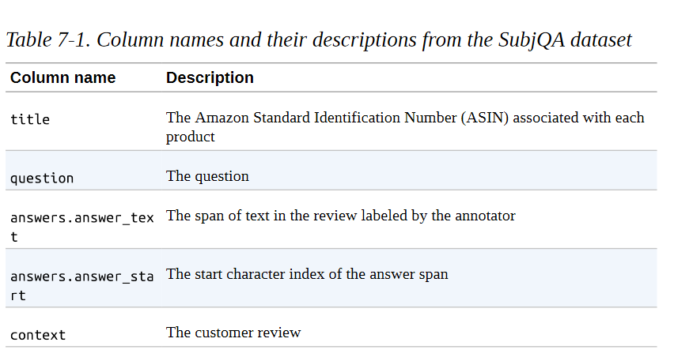

让我们把注意力集中在这些列上，并看一看几个训练实例。我们可以使用sample()方法来选择一个随机样本：

```
qa_cols = ["title", "question", "answers.text", "answers.answer_start", "context"] 
sample_df = dfs["train"][qa_cols].sample(2, random_state=7) 
sample_df

```

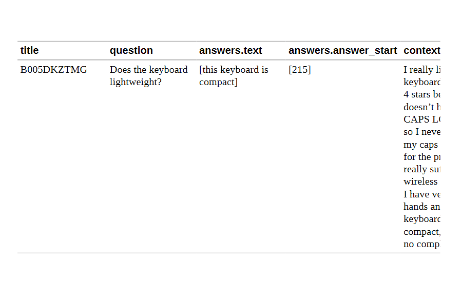

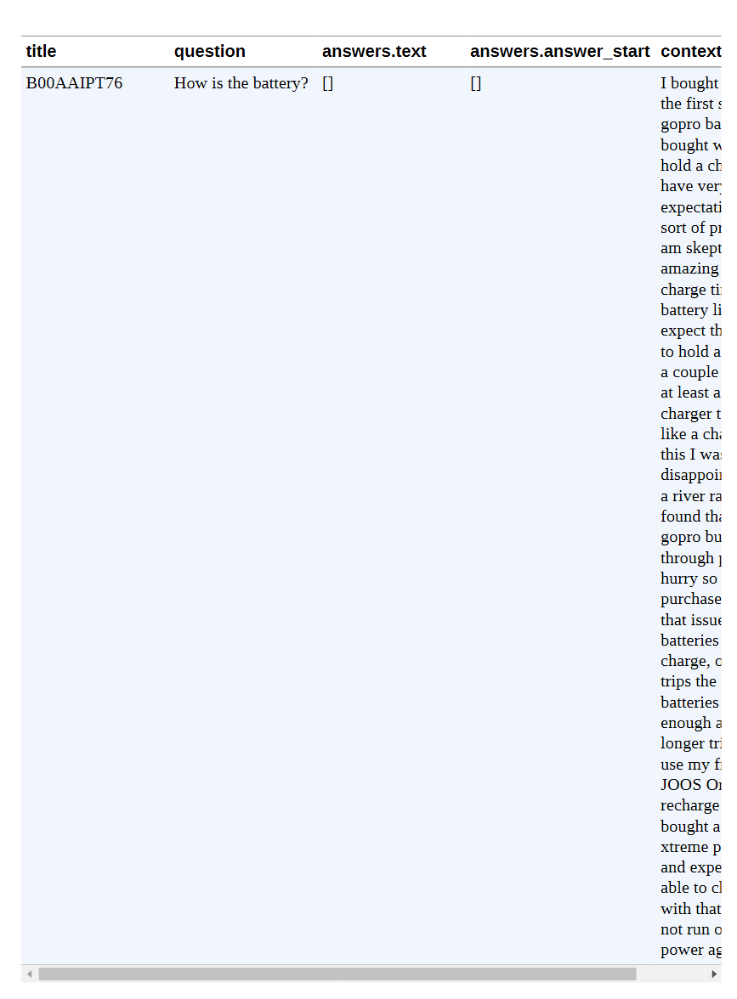

从这些例子中，我们可以提出一些看法。首先，这些问题在语法上是不正确的，这在电子商务网站的FAQ部分是很常见的。其次，一个空的answer.text条目表示 "无法回答 "的问题，在评论中找不到答案。最后，我们可以使用答案跨度的起始索引和长度来切出评论中与答案相对应的文本跨度：

```
start_idx = sample_df["answers.answer_start"].iloc[0][0] 
end_idx = start_idx + len(sample_df["answers.text"].iloc[0][0]) 
sample_df["context"].iloc[0][start_idx:end_idx]

'this keyboard is compact'

```


接下来，让我们通过计算以几个常见的起始词开始的问题，来感受一下训练集里有哪些类型的问题：


```
counts = {} 
question_types = ["What", "How", "Is", "Does", "Do", "Was", "Where", "Why"]
for q in question_types: 
	counts[q] = dfs["train"]["question"].str.startswith(q).value_counts() 
[True] 
pd.Series(counts).sort_values().plot.barh() 
plt.title("Frequency of Question Types") 
plt.show()

```

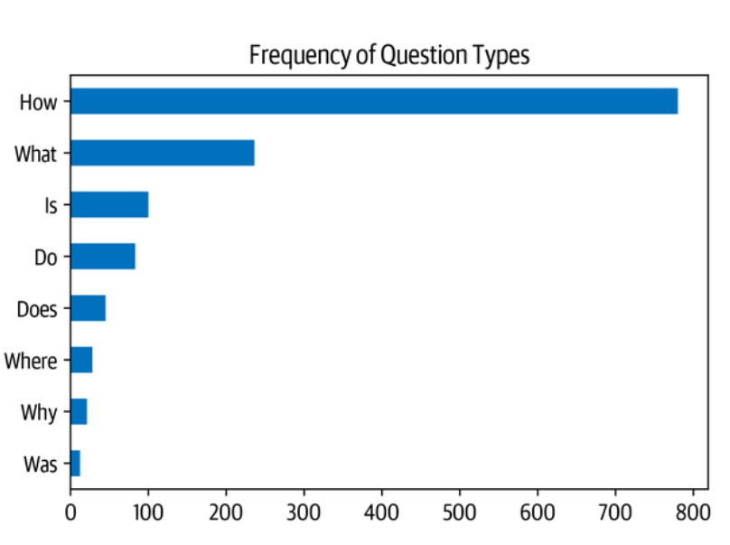

我们可以看到，以 "如何"、"什么 "和 "是 "开头的问题是最常见的问题，所以让我们看一下一些例子：

```
for question_type in ["How", "What", "Is"]: 
	for question in ( dfs["train"][dfs["train"].question.str.startswith(question_type)] .sample(n=3, random_state=42)['question']): 
		print(question) 

How is the camera?
How do you like the control? 
How fast is the charger?
What is direction? 
What is the quality of the construction of the bag?
What is your impression of the product? 
Is this how zoom works? 
Is sound clear? 
Is it a wireless keyboard?

```

------

**斯坦福大学问答数据集**

SubjQA的（问题，评论，[答案句子]）格式通常用于抽取式QA数据集，并在斯坦福大学问题回答数据集（SQuAD）中首创。这是一个著名的数据集，经常被用来测试机器阅读一段文字并回答有关问题的能力。该数据集是通过从维基百科中抽取几百篇英文文章，将每篇文章划分为几个段落，然后要求众人为每个段落生成一组问题和答案而创建的。在SQuAD的第一个版本中，每个问题的答案都被保证存在于相应的段落中。但是没过多久，序列模型就开始在提取带有答案的正确文本跨度方面比人类表现得更好。为了增加任务的难度，SQuAD 2.0是在SQuAD 1.1的基础上增加了一组对抗性问题，这些问题与给定的段落相关，但不能仅从文本中得到答案。截至本书编写时的技术水平如图7-3所示，自2019年以来，大多数模型都超过了人类的表现。

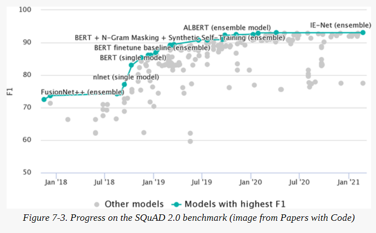

然而，这种超人的表现似乎并不反映真正的阅读理解能力，因为 "无法回答 "的问题的答案通常可以通过段落中的模式（如反义词）来识别。为了解决这些问题，谷歌发布了自然问题（NQ）数据集，其中涉及从谷歌搜索用户那里获得的事实探究问题。NQ中的答案比SQuAD中的要长得多，提出了一个更具挑战性的基准。

------

现在我们已经对我们的数据集进行了一些探索，让我们深入了解转化器如何从文本中提取答案。

### 从文本中提取答案 

我们的问答系统系统需要做的第一件事是找到一种方法，将潜在的答案识别为客户评论中的一段文字。例如，如果我们有一个问题，如 "它是防水的吗？"，而评论的段落是 "这款手表在30米深处是防水的"，那么模型应该输出 "在30米处防水"。要做到这一点，我们就需要了解如何:

-  确定监督学习问题的框架。

-  为QA任务对文本进行符号化和编码。

- 处理超过模型的最大上下文大小的长篇文章。


让我们先来看看如何设置问题的框架。

### 跨度分类

从文本中提取答案的最常见的方法是把问题看作一个跨度分类任务，其中答案跨度的开始和结束符号作为模型需要预测的标签。这个过程如图7-4所示。

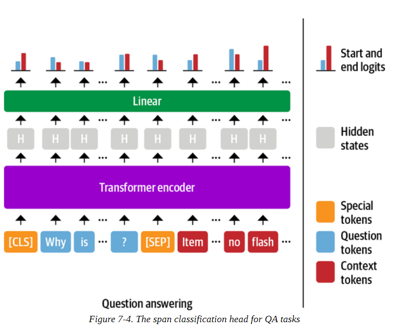

由于我们的训练集相对较小，只有1,295个例子，一个好的策略是以已经在SQuAD这样的大规模QA数据集上微调过的语言模型开始。一般来说，这些模型有很强的阅读理解能力，可以作为一个良好的基线，在此基础上建立一个更准确的系统。这与前几章采取的方法有些不同，在前几章中，我们通常从预训练的模型开始，然后自己对特定任务的头进行微调。例如，在第二章中，我们必须对分类头进行微调，因为类的数量是与手头的数据集相联系的。对于抽取式问答系统，我们实际上可以从一个微调过的模型开始，因为标签的结构在不同的数据集上保持不变。

你可以通过导航到Hugging Face Hub并在Models标签上搜索 "squad "来找到抽取式QA模型的列表（图7-5）。

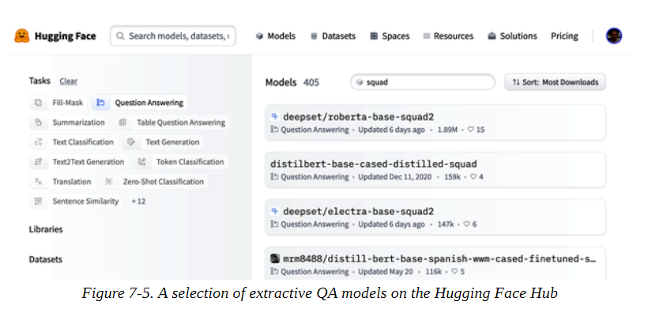

正如你所看到的，在写这篇文章的时候，有超过350个QA模型可供选择--那么你应该选择哪一个？一般来说，答案取决于各种因素，如你的语料库是单语还是多语，以及在生产环境中运行模型的限制。表7-2列出了一些可以提供良好基础的模型。

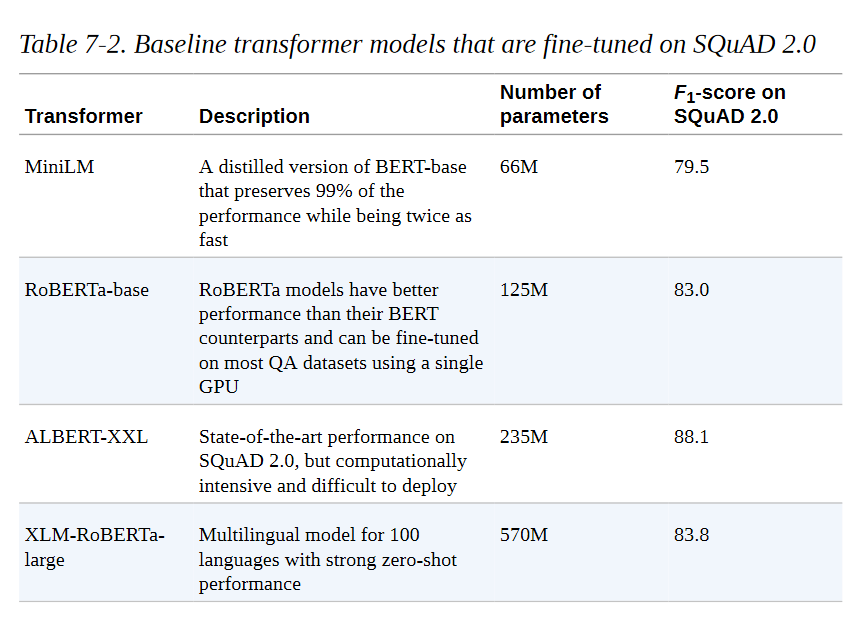

在本章中，我们将使用一个微调的MiniLM模型，因为它可以快速训练，并允许我们快速迭代我们将要探索的技术。像往常一样，我们首先需要的是一个标记器来对我们的文本进行编码，所以让我们来看看这对QA任务的作用。

### 将文本标记化用于QA

为了对我们的文本进行编码，我们将像往常一样从Hugging Face Hub加载MiniLM模型检查点:

```
from transformers import AutoTokenizer 
model_ckpt = "deepset/minilm-uncased-squad2" 
tokenizer = AutoTokenizer.from_pretrained(model_ckpt)
```

为了看到这个模型的作用，我们首先尝试从一段短文中提取一个答案。在抽取式QA任务中，输入是以（问题。语境）对，所以我们把它们都传递给标记器，如下所示:

```
uestion = "How much music can this hold?" 
context = """An MP3 is about 1 MB/minute, so about 6000 hours depending on \ file size.""" 
inputs = tokenizer(question, context, return_tensors="pt")

```

这里我们返回了PyTorch Tensor对象，因为我们需要它们来运行模型的前向传递。如果我们把标记化的输入看作一个表:


我们可以看到熟悉的input_ids和attention_mask张量，而token_type_ids张量表明输入的哪一部分对应于问题和背景（0表示问题标记，1表示背景标记）。

为了理解标记器是如何为QA任务格式化输入的，让我们对input_ids张量进行解码:

```
print(tokenizer.decode(inputs["input_ids"][0])) 

[CLS] how much music can this hold? [SEP] an mp3 is about 1 mb / minute, so about 6000 hours depending on file size. [SEP]

```

我们看到，对于每个QA的例子，输入的格式都是这样:

```
[CLS] question tokens [SEP] context tokens [SEP]

```

其中第一个[SEP]标记的位置由token_type_ids决定。现在我们的文本已经被标记化了，我们只需要用一个QA头来实例化这个模型，并通过前向传递来运行输入:

```
import torch
from transformers import AutoModelForQuestionAnswering 
model = AutoModelForQuestionAnswering.from_pretrained(model_ckpt)
with torch.no_grad(): 
	outputs = model(**inputs) 
	print(outputs) 

QuestionAnsweringModelOutput(loss=None, start_logits=tensor([[-0.9862, -4.7750, -5.4025, -5.2378, -5.2863, -5.5117, -4.9819, -6.1880, -0.9862, 0.2596, -0.2144, -1.7136, 3.7806, 4.8561, -1.0546, -3.9097, -1.7374, -4.5944, -1.4278, 3.9949, 5.0390, -0.2018, -3.0193, -4.8549, -2.3107, -3.5110, -3.5713, -0.9862]]), end_logits=tensor([[-0.9623, -5.4733, -5.0326, -5.1639, -5.4278, -5.5151, -5.1749, -4.6233, -0.9623, -3.7855, -0.8715, -3.7745, -3.0161, -1.1780, 0.1758, -2.7365, 4.8934, 0.3046, -3.1761, -3.2762, 0.8937, 5.6606, -0.3623, -4.9554, -3.2531, -0.0914, 1.6211, -0.9623]]), hidden_states=None, attentions=None)

```

这里我们可以看到，我们得到了一个QuestionAnsweringModelOutput对象作为QA头的输出。如图7-4所示，QA头对应于一个线性层，它从编码器中获取隐藏状态，并计算出开始和结束跨度的对数。这意味着我们把QA当作一种标记分类的形式，类似于我们在第四章中遇到的命名实体识别的情况。为了将输出转换为答案跨度，我们首先需要得到开始和结束标记的对数:

```
start_logits = outputs.start_logits 
end_logits = outputs.end_logits
```

如果我们将这些对数的形状与输入的ID进行比较:

```
print(f"Input IDs shape: {inputs.input_ids.size()}") 
print(f"Start logits shape: {start_logits.size()}") 
print(f"End logits shape: {end_logits.size()}") 

Input IDs shape: torch.Size([1, 28]) 
Start logits shape: torch.Size([1, 28])
End logits shape: torch.Size([1, 28])

```

我们看到有两个对数（开始和结束）与每个输入符号相关。如图7-6所示，较大的正对数对应于更有可能的开始和结束标记的候选人。在这个例子中，我们可以看到模型将最高的起始标记对数分配给了数字 "1 "和 "6000"，这是有道理的，因为我们的问题是关于一个数量。同样地，我们看到，具有最高对数的结束标记是 "分钟 "和 "小时"。

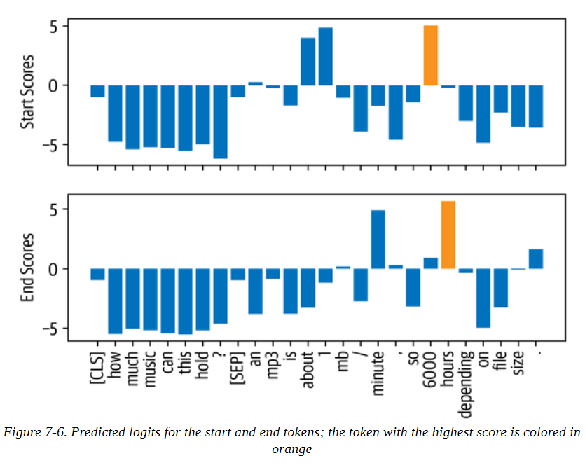

为了得到最终的答案，我们可以计算开始和结束标记对数的argmax，然后从输入中切出跨度。下面的代码执行了这些步骤，并对结果进行了解码，因此我们可以打印出结果文本：

```
import torch 
start_idx = torch.argmax(start_logits) 
end_idx = torch.argmax(end_logits) + 1 
answer_span = inputs["input_ids"][0][start_idx:end_idx] 
answer = tokenizer.decode(answer_span) 
print(f"Question: {question}") 
print(f"Answer: {answer}") 

Question: How much music can this hold? 
Answer: 6000 hours

```

很好，它成功了! 在Transformers中，所有这些预处理和后处理的步骤都方便地封装在一个专门的流水线中。我们可以通过传递我们的标记器和微调模型来实例化这个流水线，如下所示:

```
from transformers import pipeline 
pipe = pipeline("question-answering", model=model, tokenizer=tokenizer) 
pipe(question=question, context=context, topk=3) 

[{'score': 0.26516005396842957, 'start': 38, 'end': 48, 'answer': '6000 hours'}, {'score': 0.2208300083875656, 'start': 16, 'end': 48, 'answer': '1 MB/minute, so about 6000 hours'}, {'score': 0.10253632068634033, 'start': 16, 'end': 27, 'answer': '1 MB/minute'}]

```

除了答案之外，该流水线还在分数字段中返回模型的概率估计值（通过对对数的softmax获得）。当我们想在一个单一的环境中比较多个答案时，这很方便。我们还表明，我们可以通过指定topk参数让模型预测多个答案。有时，有可能出现没有答案的问题，比如SubjQA中的空answer.answer_start例子。在这些情况下，模型会给[CLS]标记分配一个高的开始和结束分数，流水线会将这个输出映射为一个空字符串:

```
pipe(question="Why is there no data?", context=context, handle_impossible_answer=True)

{'score': 0.9068416357040405, 'start': 0, 'end': 0, 'answer': ''}

```

 **注意事项**


在我们的简单例子中，我们通过获取相应对数的argmax来获得开始和结束指数。然而，这种启发式方法可以通过选择属于问题而不是上下文的标记而产生超范围的答案。在实践中，流水线会根据各种约束条件计算出起点和终点指数的最佳组合，如在范围内，要求起点指数在终点指数之前，等等。


### 处理长的段落

阅读理解模型所面临的一个微妙问题是，上下文所包含的标记往往比模型的最大序列长度（通常最多只有几百个标记）要多。如图77所示，SubjQA训练集中有相当一部分包含的问题与语境对不适合MiniLM的512个语境大小。

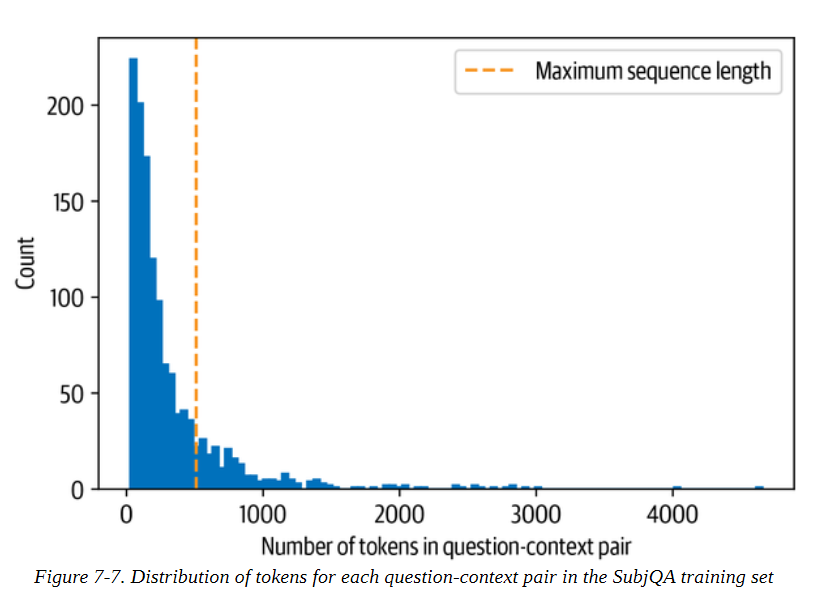

对于其他任务，如文本分类，我们只是简单地截断长文本，假设[CLS]标记的嵌入中包含足够的信息来产生准确的预测。然而，对于QA来说，这种策略是有问题的，因为问题的答案可能就在上下文的末尾，因此会被截断而删除。如图7-8所示，处理这个问题的标准方法是在输入中应用一个滑动窗口，每个窗口都包含一段符合模型上下文的标记。


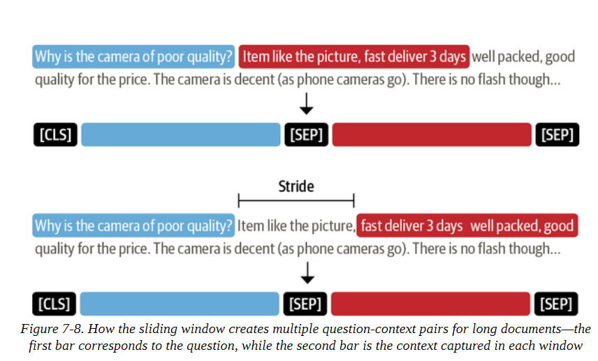

在Transformers中，我们可以在tokenizer中设置return_overflowing_tokens=True来启用滑动窗口。滑动窗口的大小由max_seq_length参数控制，而stride的大小则由doc_stride控制。让我们从我们的训练集中抓取第一个例子，并定义一个小的窗口来说明它是如何工作的：

```
example = dfs["train"].iloc[0][["question", "context"]] 
tokenized_example = tokenizer(example["question"], example["context"], return_overflowing_tokens=True, max_length=100, stride=25)

```

在这种情况下，我们现在得到一个input_ids的列表，每个窗口都有一个。让我们检查一下每个窗口中的令牌数量：

```
for idx, window in enumerate(tokenized_example["input_ids"]): 
print(f"Window #{idx} has {len(window)} tokens") 

Window #0 has 100 tokens W
indow #1 has 88 tokens

```

最后，我们可以通过解码输入看到两个窗口重叠的地方：

```
for window in tokenized_example["input_ids"]: 
	print(f"{tokenizer.decode(window)} \n") 
	
[CLS] how is the bass? [SEP] i have had koss headphones in the past, pro 4aa and qz - 99. the koss portapro is portable and has great bass response. the work great with my android phone and can be " rolled up " to be carried in my motorcycle jacket or computer bag without getting crunched. they are very light and don't feel heavy or bear down on your ears even after listening to music with them on all day. the sound is [SEP]

[CLS] how is the bass? [SEP] and don't feel heavy or bear down on your ears even after listening to music with them on all day. the sound is night and day better than any ear - bud could be and are almost as good as the pro 4aa. they are " open air " headphones so you cannot match the bass to the sealed types, but it comes close. for $ 32, you cannot go wrong. [SEP]

```

现在我们对QA模型如何从文本中提取答案有了一些直觉，让我们来看看建立一个端到端QA流水线所需要的其他组件。

### 使用Haystack来建立一个QA流水线

在我们简单的答案提取例子中，我们同时向模型提供了问题和背景。然而，在现实中，我们系统的用户只会提供一个关于产品的问题，所以我们需要从我们语料库中的所有评论中选择相关的段落。一种方法是将一个产品的所有评论串联起来，并将其作为一个单一的、长的上下文提供给模型。虽然简单，但这种方法的缺点是，上下文可能会变得非常长，从而为我们的用户的查询带来不可接受的延迟。例如，我们假设每个产品平均有30条评论，每条评论需要100毫秒来处理。如果我们需要处理所有的评论来获得答案，这将导致每个用户查询的平均延迟为3秒--对于电子商务网站来说太长了。

为了处理这个问题，现代QA系统通常基于retriever-reader架构，它有两个主要组成部分：

**检索器** 

负责为一个给定的查询检索相关的文件。检索器通常分为稀疏型和密集型。稀疏检索器使用词频将每个文档和查询表示为一个稀疏的向量。然后通过计算向量的内积来确定查询和文档的相关性。另一方面，密集检索器使用编码器，如Transformers，将查询和文档表示为上下文嵌入（这是密集向量）。这些嵌入对语义进行编码，并允许密集检索器通过理解查询的内容来提高搜索精度。
**阅读器**

负责从检索器提供的文件中提取答案。阅读器通常是一个阅读理解模型，尽管在本章的最后，我们将看到可以生成自由形式答案的模型的例子。

如图7-9所示，还可以有其他组件对检索器获取的文件或读者提取的答案进行后处理。例如，检索到的文件可能需要重新排序，以消除可能使读者困惑的嘈杂或不相关的文件。同样地，当正确的答案来自于一份长文件中的不同段落时，往往需要对读者的答案进行后处理。

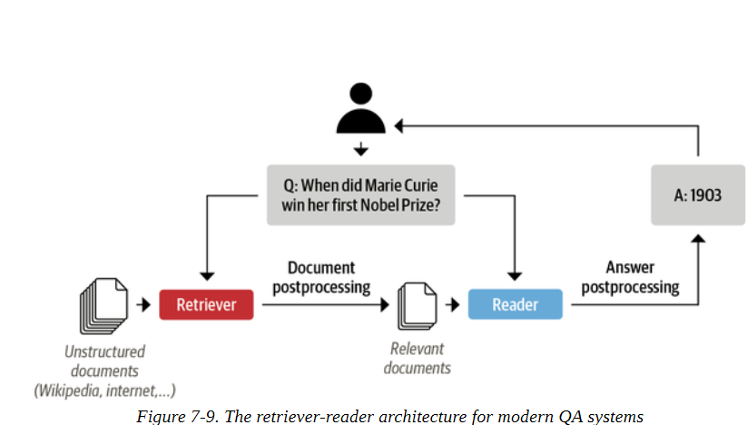

为了建立我们的QA系统，我们将使用由deepset开发的Haystack库，一家专注于NLP的德国公司。Haystack是基于检索器-阅读器的架构，抽象了构建这些系统所涉及的大部分复杂性，并与Transformers紧密集成。

除了检索器和阅读器之外，在用Haystack构建QA流水线时，还有两个组件参与：

**文档存储** 

一个面向文档的数据库，存储文档和元数据，在查询时提供给检索器。

**流水线**

结合QA系统的所有组件，以实现自定义查询流程，合并来自多个检索器的文档，以及更多。

在这一节中，我们将看看我们如何使用这些组件来快速建立一个原型的QA流水线。稍后，我们将研究如何提高其性能。


**警告**

本章是使用0.9.0版本的Haystack库编写的。在0.10.0版本中，流水线和评估API被重新设计，使其更容易检查检索器或阅读器是否影响性能。要想看看本章的代码在新的API下是什么样子的，请查看GitHub仓库。


### 初始化文档库

在Haystack中，有各种文档存储可供选择，每一种都可以与一组专门的检索器相匹配。表7-3说明了这一点，其中显示了稀疏（TF-IDF，BM25）和密集（Embedding，DPR）检索器对每个可用文档存储的兼容性。我们将在本章后面解释所有这些缩写词的含义。

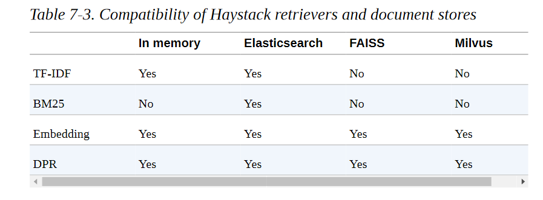

由于我们将在本章中探索稀疏和密集检索器，我们将使用ElasticsearchDocumentStore，它与两种检索器类型兼容。Elasticsearch是一个搜索引擎，能够处理各种数据类型，包括文本、数字、地理空间、结构化和非结构化。它能够存储大量的数据，并通过全文搜索功能快速过滤，这使得它特别适合开发QA系统。它的优势还在于它是基础设施分析的行业标准，所以很有可能你的公司已经有一个你可以使用的集群。


为了初始化文档存储，我们首先需要下载并安装Elasticsearch。通过遵循Elasticsearch的指南，我们可以用wget抓取Linux的最新版本，并用tar shell命令解压它：

```
url = """https://artifacts.elastic.co/downloads/elasticsearch/\ elasticsearch-7.9.2-linux-x86_64.tar.gz""" 
!wget -nc -q {url} 
!tar -xzf elasticsearch-7.9.2-linux-x86_64.tar.gz

```

接下来我们需要启动Elasticsearch服务器。由于我们在Jupyter笔记本中运行本书的所有代码，我们需要使用Python的Popen()函数来产生一个新的进程。当我们这样做的时候，也让我们使用chown shell命令在后台运行这个子进程：

```
import os from subprocess import Popen, PIPE, STDOUT 
# Run Elasticsearch as a background process 
!chown -R daemon:daemon elasticsearch-7.9.2 
es_server = Popen(args=['elasticsearch-7.9.2/bin/elasticsearch'], stdout=PIPE, stderr=STDOUT, preexec_fn=lambda: os.setuid(1)) 
# Wait until Elasticsearch has started 
!sleep 30

```

在Popen()函数中，args指定了我们希望执行的程序，而stdout=PIPE为标准输出创建了一个新流水线，stderr=STDOUT在同一流水线中收集错误。preexec_fn参数指定了我们希望使用的子进程的ID。默认情况下，Elasticsearch在本地9200端口运行，所以我们可以通过向localhost发送HTTP请求来测试连接：

```
!curl -X GET "localhost:9200/?pretty" 

{ "name" : "96938eee37cd", "cluster_name" : "docker-cluster", "cluster_uuid" : "ABGDdvbbRWmMb9Umz79HbA", "version" : { "number" : "7.9.2", 1
"build_flavor" : "default", "build_type" : "docker", "build_hash" : "d34da0ea4a966c4e49417f2da2f244e3e97b4e6e", "build_date" : "2020-09-23T00:45:33.626720Z", "build_snapshot" : false, "lucene_version" : "8.6.2", "minimum_wire_compatibility_version" : "6.8.0", "minimum_index_compatibility_version" : "6.0.0-beta1" }, "tagline" : "You Know, for Search" }

```

现在我们的Elasticsearch服务器已经启动并运行，接下来要做的是实例化文档存储：

```
from haystack.document_store.elasticsearch import ElasticsearchDocumentStore 
# Return the document embedding for later use with dense retriever 
document_store = ElasticsearchDocumentStore(return_embedding=True)

```

默认情况下，ElasticsearchDocumentStore在Elasticsearch上创建了两个索引：一个叫document，用于（你猜对了）存储文档，另一个叫label，用于存储注释的答案跨度。现在，我们只是用SubjQA的评论来填充文档索引，Haystack的文档存储期待一个带有文本和元键的字典列表，如下所示：

```
{ 
"text": "<the-context>", 
"meta": 
	{ 
    "field_01": "<additional-metadata>", 
    "field_02": "<additional-metadata>", ... 
    } 
}

```

meta中的字段可用于在检索过程中应用过滤器。对于我们的目的，我们将包括SubjQA的item_id和q_review_id列，这样我们就可以通过产品和问题的ID以及相应的训练分割进行过滤。然后我们可以循环浏览每个DataFrame中的例子，并用write_documents()方法将它们添加到索引中，如下所示：

```
for split, df in dfs.items(): 
	# Exclude duplicate reviews 
	docs = [{"text": row["context"], "meta":{"item_id": row["title"], "question_id": row["id"], "split": split}} 
	for _,row in df.drop_duplicates(subset="context").iterrows()]
	document_store.write_documents(docs, index="document") 
print(f"Loaded {document_store.get_document_count()} documents") 

Loaded 1615 documents

```

很好，我们已经把所有的评论加载到一个索引中了！为了搜索索引，我们需要一个检索器。为了搜索这个索引，我们需要一个检索器，所以让我们看看如何为Elasticsearch初始化一个检索器。

### 初始化检索器

Elasticsearch文档存储可以与任何一个Haystack检索器配对，所以我们先用一个基于BM25（"最佳匹配25 "的缩写）的稀疏检索器。BM25是经典的术语频率-反向文档频率（TF-IDF）算法的改进版，它将问题和上下文表示为稀疏向量，可以在Elasticsearch上有效搜索。BM25得分衡量匹配的文本与搜索查询有关的程度，并通过快速饱和TF值和规范化文档长度来改进TF-IDF，使短文档比长文档更受青睐。

在Haystack中，BM25检索器被默认用于ElasticsearchRetriever，所以让我们通过指定我们希望搜索的文档存储来初始化这个类：

```
from haystack.retriever.sparse import ElasticsearchRetriever 
es_retriever = ElasticsearchRetriever(document_store=document_store)

```

接下来，让我们看看对训练集中的一个单一电子产品的简单查询。对于像我们这样基于评论的QA系统来说，将查询限制在一个单一的项目上是很重要的，因为否则检索器会找到与用户查询无关的产品评论。例如，在没有产品过滤器的情况下，问 "相机质量好吗？"可能会返回关于手机的评论，而用户可能是在问一个特定的笔记本电脑相机。就其本身而言，我们数据集中的ASIN值有点隐晦，但我们可以通过在线工具（如amazon ASIN）或简单地将item_id的值附加到www.amazon.com/dp/，来破译它们。下面的项目ID对应于亚马逊的Fire平板电脑之一，所以让我们使用检索器的retrieve()方法来询问它是否适合用于阅读：

```
item_id = "B0074BW614" 
query = "Is it good for reading?" 
retrieved_docs = es_retriever.retrieve( query=query, top_k=3, filters={"item_id":[item_id], "split":["train"]})

```

在这里，我们用top_k参数指定了要返回的文档数量，并对包含在文档元字段中的item_id和split键都应用了一个过滤器。retrieved_docs的每个元素都是一个Haystack文档对象，用来表示文档，包括检索器的查询分数和其他元数据。让我们来看看其中一个检索到的文档：

```
print(retrieved_docs[0])

{'text': 'This is a gift to myself. I have been a kindle user for 4 years and this is my third one. I never thought I would want a fire for I mainly use it for book reading. I decided to try the fire for when I travel I take my laptop, my phone and my iPod classic. I love my iPod but watching movies on the plane with it can be challenging because it is so small. Laptops battery life is not as good as the Kindle. So the Fire combines for me what I needed all three to do. So far so good.', 'score': 6.243799, 'probability': 0.6857824513476455, 'question': None, 'meta': {'item_id': 'B0074BW614', 'question_id': '868e311275e26dbafe5af70774a300f3', 'split': 'train'}, 'embedding': None,
'id': '252e83e25d52df7311d597dc89eef9f6'}

```

除了文档的文本之外，我们还可以看到Elasticsearch为其与查询的相关性所计算的分数（更大的分数意味着更好的匹配）。在引擎盖下，Elasticsearch依靠Lucene进行索引和搜索，所以默认情况下它使用Lucene的实用评分功能。你可以在Elasticsearch的文档中找到评分功能背后的具体细节，但简单来说，它首先通过应用布尔测试来过滤候选文档（该文档是否与查询相匹配），然后应用一个基于代表文档和查询的向量的相似性指标。

现在我们有了一种检索相关文件的方法，接下来我们需要的是一种从这些文件中提取答案的方法。这就是读者的作用，所以让我们看看我们如何在Haystack中加载我们的MiniLM模型。


### 初始化一个阅读器

在Haystack中，有两种类型的阅读器，人们可以用来从给定的上下文中提取答案。
 **FARMReader** 

基于deepset的FARM框架，用于微调和部署Transformers。与使用Transformers训练的模型兼容，可以直接从Hugging Face Hub加载模型。

**TransformersReade**r

基于Transformers的QA流水线。仅适用于运行推理。

 尽管两个阅读器以相同的方式处理模型的权重，但在预测转换为产生答案的方式上有一些差异。

- 在Transformers中，QA流水线在每个段落中用一个softmax将开始和结束的对数归一。这意味着，只有在概率之和为1的情况下，比较从同一段落中提取的答案分数才有意义。例如，一个段落中的0.9分的答案不一定比另一个段落中的0.8分要好。在FARM中，对数没有被规范化，所以段落间的答案可以更容易地进行比较。
- TransformersReader有时会预测同一个答案两次，但分数却不同。如果答案横跨两个重叠的窗口，这种情况就会发生在长文中。在FARM中，这些重复的答案会被删除。


由于我们将在本章的后面对阅读器进行微调，我们将使用FARMReader。和Transformers一样，为了加载模型，我们只需要在Hugging Face Hub上指定MiniLM检查点以及一些QA专用参数:

```
from haystack.reader.farm import FARMReader 
model_ckpt = "deepset/minilm-uncased-squad2" 
max_seq_length, doc_stride = 384, 128 
reader = FARMReader(model_name_or_path=model_ckpt, progress_bar=False, max_seq_len=max_seq_length, doc_stride=doc_stride, return_no_answer=True)

```


**注意事项**

也可以直接在Transformers中对阅读理解模型进行微调，然后将其加载到TransformersReader中运行推理。关于如何进行微调步骤的细节，请参见库的文档中的问题回答教程。

在FARMReader中，滑动窗口的行为是由max_seq_length和doc_stride参数控制的，就像我们看到的针对 tokenizer的参数控制。这里我们使用了MiniLM论文中的数值。为了确认，现在让我们在前面的简单例子上测试一下这个阅读器：


```
print(reader.predict_on_texts(question=question, texts=[context], top_k=1)) 

{'query': 'How much music can this hold?', 'no_ans_gap': 12.648084878921509, 'answers': [{'answer': '6000 hours', 'score': 10.69961929321289, 'probability': 0.3988136053085327, 'context': 'An MP3 is about 1 MB/minute, so about 6000 hours depending on file size.', 'offset_start': 38, 'offset_end': 48, 'offset_start_in_doc': 38, 'offset_end_in_doc': 48, 'document_id': 'e344757014e804eff50faa3ecf1c9c75'}]}

```

很好，读者似乎在按预期工作--所以接下来，让我们用Haystack的一个流水线把我们所有的组件联系起来。

### 把所有的东西放在一起

Haystack提供了一个流水线抽象，允许我们将检索器、阅读器和其他组件结合在一起，作为一个图，可以很容易地为每个用例定制。还有一些预定义的流水线，类似于Transformers中的流水线，但专门用于QA系统。在我们的案例中，我们对提取答案感兴趣，所以我们将使用ExtractiveQAPipeline，它需要一个检索器-阅读器对作为其参数：

```
from haystack.pipeline import ExtractiveQAPipeline 
pipe = ExtractiveQAPipeline(reader, es_retriever)

```

每个流水线都有一个run()方法，指定查询流程应该如何执行。对于ExtractiveQAPipeline，我们只需要传递查询，用top_k_retriever检索的文档数量，以及用top_k_reader从这些文档中提取的答案数量。在我们的例子中，我们还需要在项目ID上指定一个过滤器，这可以使用过滤器参数来完成，就像我们之前对检索器做的那样。让我们运行一个简单的例子，再次使用我们关于亚马逊Fire平板电脑的问题，但这次是返回提取的答案：

```
n_answers = 3 
preds = pipe.run(query=query, top_k_retriever=3, top_k_reader=n_answers, filters={"item_id": [item_id], "split":["train"]}) 
print(f"Question: {preds['query']} \n") 
for idx in range(n_answers): 
	print(f"Answer {idx+1}: {preds['answers'][idx]['answer']}") 
	print(f"Review snippet: ...{preds['answers'][idx]['context']}...") 
	print("\n\n") 

Question: Is it good for reading? 

Answer 1: I mainly use it for book reading Review snippet: ... is my third one. I never thought I would want a fire for I mainly use it for book reading. I decided to try the fire for when I travel I take my la... 

Answer 2: the larger screen compared to the Kindle makes for easier reading Review snippet: ...ght enough that I can hold it to read, but the larger screen compared to the Kindle makes for easier reading. I love the color, something I never thou... 

Answer 3: it is great for reading books when no light is available Review snippet: ...ecoming addicted to hers! Our son LOVES it and it is great for reading books when no light is available. Amazing sound but I suggest good headphones t...

```

很好，我们现在有了一个针对亚马逊产品评论的端到端QA系统! 这是一个好的开始，但注意到第二个和第三个答案更接近于问题的实际要求。为了做得更好，我们需要一些指标来量化检索器和阅读器的性能。我们接下来会看一下这个问题。

## 改善我们的QA流水线

尽管最近关于QA的许多研究都集中在改进阅读理解模型上，但在实践中，如果检索器不能首先找到相关的文件，那么你的读者有多好也就不重要了！特别是，检索器为整个QA系统的性能设定了一个上限，所以必须确保它做得好。特别是，检索器为整个QA系统的性能设定了一个上限，所以确保它做得好很重要。考虑到这一点，让我们首先介绍一些评估检索器的常用指标，以便我们能够比较稀疏和密集表示的性能。

### 评估检索器

评估检索器的一个常用指标是召回率，它衡量的是检索到的所有相关文档的比例。在这种情况下，"相关 "仅仅意味着答案是否出现在一段文本中，因此给定一组问题，我们可以通过计算答案出现在检索器返回的前k个文档中的次数来计算召回率。

在Haystack中，有两种方法来评估检索器:

- 使用检索器内置的eval()方法。这可以用于开放域和封闭域的QA，但不能用于像SubjQA这样的数据集，其中每个文档与一个产品配对，我们需要对每个查询进行产品ID过滤。
- 构建一个自定义流水线，将检索器与EvalRetriever类结合起来。这样就可以实现自定义指标和查询流程。

**注意事项**

召回率的一个补充指标是平均精度（mAP），它奖励那些能将正确答案放在文档排名中较高位置的检索者。


由于我们需要评估每个产品的召回情况，然后在所有产品中进行汇总，所以我们将选择第二种方法。流水线图中的每个节点代表一个类，它通过run()方法接受一些输入并产生一些输出：

```
class PipelineNode: 
	def __init__(self): 
		self.outgoing_edges = 1 
	def run(self, **kwargs): 
		... 
		return (outputs, "outgoing_edge_name")

```

这里的kwargs对应于图中前一个节点的输出，在run()方法中进行处理，以返回下一个节点的输出的一个元组，以及一个出站边的名称。唯一的其他要求是包括一个outgoing_edges属性，表示节点的输出数量（在大多数情况下outgoing_edges=1，除非你在流水线上有分支，根据一些标准对输入进行路由）。

在我们的案例中，我们需要一个节点来评估检索器，所以我们将使用EvalRetriever类，它的run()方法可以跟踪哪些文档的答案与地面真相一致。有了这个类，我们就可以通过在代表检索器本身的节点之后添加评估节点来建立一个流水线图：


```
from haystack.pipeline import Pipeline 
from haystack.eval import EvalDocuments 
class EvalRetrieverPipeline: 
	def __init__(self, retriever): 
		self.retriever = retriever 
		self.eval_retriever = EvalDocuments() 
		pipe = Pipeline() pipe.add_node(component=self.retriever, name="ESRetriever", inputs=["Query"]) 
		pipe.add_node(component=self.eval_retriever, name="EvalRetriever", inputs=["ESRetriever"]) 
		self.pipeline = pipe
		
pipe = EvalRetrieverPipeline(es_retriever)

```

请注意，每个节点都有一个名称和一个输入列表。在大多数情况下，每个节点都有一条流出的边，所以我们只需要在输入中包括前一个节点的名称。

现在我们有了评估流水线，我们需要传递一些查询和它们相应的答案。为了做到这一点，我们将把答案添加到我们的文档存储中的一个专用标签索引中。Haystack提供了一个Label对象，以标准化的方式表示答案的跨度和它们的元数据。为了填充标签索引，我们将首先创建一个标签对象的列表，通过循环测试集中的每个问题，提取匹配的答案和额外的元数据:

```
from haystack import Label 
labels = [] 
for i, row in dfs["test"].iterrows():
	# Metadata used for filtering in the Retriever 
	meta = {"item_id": row["title"], "question_id": row["id"]} 
	# Populate labels for questions with answers 
	if len(row["answers.text"]): 
		for answer in row["answers.text"]: 
			label = Label( question=row["question"], answer=answer, id=i, origin=row["id"], meta=meta, is_correct_answer=True, is_correct_document=True, no_answer=False) 
			labels.append(label) 
			# Populate labels for questions without answers
     else: 
     	label = Label( question=row["question"], answer="", id=i, origin=row["id"], meta=meta, is_correct_answer=True, is_correct_document=True, no_answer=True) 
     	labels.append(label)

```

如果我们查看下这些标签中的一个:

```
print(labels[0])

{'id': 'e28f5e62-85e8-41b2-8a34-fbff63b7a466', 'created_at': None, 'updated_at': None, 'question': 'What is the tonal balance of these headphones?', 'answer': 'I have been a headphone fanatic for thirty years', 'is_correct_answer': True, 'is_correct_document': True, 'origin': 'd0781d13200014aa25860e44da9d5ea7', 'document_id': None, 'offset_start_in_doc': None, 'no_answer': False, 'model_id': None, 'meta': {'item_id': 'B00001WRSJ', 'question_id': 'd0781d13200014aa25860e44da9d5ea7'}}

```

我们可以看到问题-答案对，以及一个包含唯一问题ID的原点字段，这样我们就可以按问题过滤文档存储。我们还在元字段中添加了产品ID，这样我们就可以按产品过滤标签了。现在我们有了我们的标签，我们可以把它们写到Elasticsearch的标签索引中，如下所示：

```
document_store.write_labels(labels, index="label") 
print(f"""Loaded {document_store.get_label_count(index="label")} \ question-answer pairs""") 

Loaded 358 question-answer pairs

```

接下来，我们需要在我们的问题ID和相应的答案之间建立一个映射，我们可以把它传递给流水线。为了获得所有的标签，我们可以使用文档存储中的get_all_labels_aggregated()方法，该方法将聚合所有与唯一ID相关的问题-答案对。这个方法返回一个MultiLabel对象的列表，但在我们的例子中，我们只得到一个元素，因为我们是按问题ID过滤的。我们可以建立一个聚合标签的列表，如下所示：

```
labels_agg = document_store.get_all_labels_aggregated( index="label", open_domain=True, aggregate_by_meta=["item_id"] ) 

print(len(labels_agg)) 

330

```

通过查看这些标签中的一个，我们可以看到，与一个给定问题相关的所有答案都聚集在一个multiple_answers字段中：


```
print(labels_agg[109]) 

{'question': 'How does the fan work?', 'multiple_answers': ['the fan is really really good', "the fan itself isn't super loud. There is an adjustable dial to change fan speed"], 'is_correct_answer': True, 'is_correct_document': True, 'origin': '5a9b7616541f700f103d21f8ad41bc4b', 'multiple_document_ids': [None, None], 'multiple_offset_start_in_docs': [None, None], 'no_answer': False, 'model_id': None, 'meta': {'item_id': 'B002MU1ZRS'}}

```

我们现在拥有评估检索器的所有成分，所以让我们定义一个函数，将与每个产品相关的每个问题-答案对送入评估流水线，并在我们的流水线对象中跟踪正确的检索：

```
def run_pipeline(pipeline, top_k_retriever=10, top_k_reader=4): 
	for l in labels_agg:
    	_ = pipeline.pipeline.run( query=l.question, top_k_retriever=top_k_retriever, top_k_reader=top_k_reader, top_k_eval_documents=top_k_retriever, labels=l, filters={"item_id": [l.meta["item_id"]], "split": ["test"]}) 

run_pipeline(pipe, top_k_retriever=3) 
print(f"Recall@3: {pipe.eval_retriever.recall:.2f}")
    
Recall@3: 0.95

```

很好，它起作用了! 请注意，我们为top_k_retriever选了一个特定的值来指定要检索的文档数量。一般来说，增加这个参数会提高召回率，但代价是向读者提供更多的文档，并减慢端到端的流水线。为了指导我们决定选择哪个值，我们将创建一个函数，在几个k值上循环，计算每个k在整个测试集中的召回率：

```
def evaluate_retriever(retriever, topk_values = [1,3,5,10,20]): 
	topk_results = {} 
	for topk in topk_values: 
		# Create Pipeline 
		p = EvalRetrieverPipeline(retriever) 
		# Loop over each question-answers pair in test set 
		run_pipeline(p, top_k_retriever=topk) 
		# Get metrics 
		topk_results[topk] = {"recall": p.eval_retriever.recall} 
	return pd.DataFrame.from_dict(topk_results, orient="index") 
es_topk_df = evaluate_retriever(es_retriever)

```

如果我们把结果画出来，我们可以看到，随着k的增加，召回率是如何提高的：

```
def plot_retriever_eval(dfs, retriever_names): 
	fig, ax = plt.subplots() 
	for df, retriever_name in zip(dfs, retriever_names): 
		df.plot(y="recall", ax=ax, label=retriever_name) 
	plt.xticks(df.index) 
	plt.ylabel("Top-k Recall") 
	plt.xlabel("k")
    plt.show() 
plot_retriever_eval([es_topk_df], ["BM25"])

```

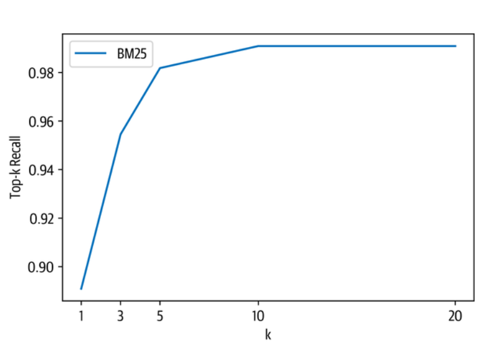

从图中我们可以看到，在k=5附近有一个拐点，从k=10开始我们几乎得到了完美的召回率。现在让我们来看看用密集向量技术检索文件的情况。

### 密集段落检索

我们已经看到，当我们的稀疏检索器返回k = 10个文档时，我们得到了几乎完美的召回率，但是在k值较小的情况下，我们是否可以做得更好呢？这样做的好处是，我们可以把更少的文档传递给读者，从而减少我们QA流水线的整体延迟。像BM25这样的稀疏检索器的一个众所周知的局限性是，如果用户查询包含的术语与评论中的术语不完全匹配，它们可能无法捕捉到相关的文档。一个有希望的替代方法是使用密集嵌入来表示问题和文档，目前的技术状况是一种被称为密集通道检索（DPR）的架构。DPR的主要思想是使用两个BERT模型作为问题和段落的编码器。如图7-10所示，这些编码器将输入文本映射为[CLS]标记的d维向量表示。


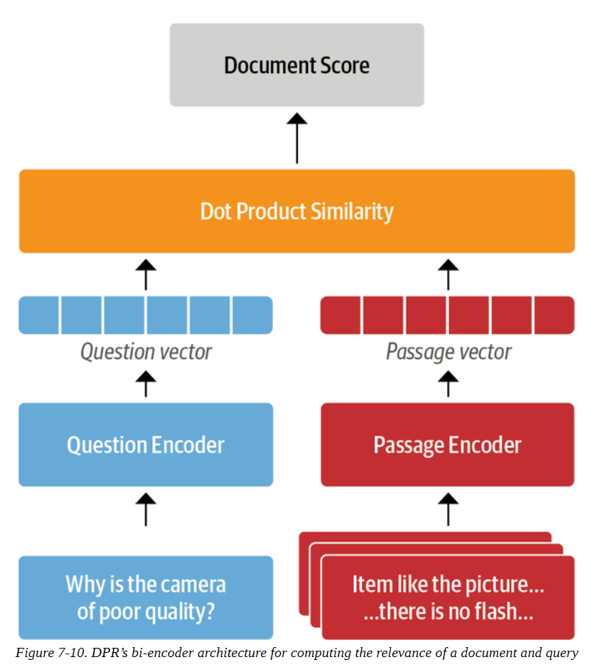

在Haystack中，我们可以用与BM25类似的方式为DPR初始化一个检索器。除了指定文档存储之外，我们还需要为问题和段落挑选BERT编码器。这些编码器是通过给它们提供相关（积极）段落和不相关（消极）段落的问题来训练的，目的是学习相关的问题-段落对具有更高的相似性。对于我们的用例，我们将使用在NQ语料库上以这种方式进行微调的编码器：

```
from haystack.retriever.dense import DensePassageRetriever 
dpr_retriever = DensePassageRetriever(document_store=document_store, query_embedding_model="facebook/dpr-question_encoder-single-nq-base", passage_embedding_model="facebook/dpr-ctx_encoder-single-nq-base", embed_title=False)

```

这里我们还设置了embed_title=False，因为连接文档的标题（即item_id）并不能提供任何额外的信息，因为我们是按产品过滤。一旦我们初始化了密集检索器，下一步就是遍历Elasticsearch索引中的所有索引文档，并应用编码器来更新嵌入表示。这可以按以下方式完成：

```
document_store.update_embeddings(retriever=dpr_retriever)

```

我们现在可以开始行动了! 我们可以用评估BM25的同样方法来评估密集检索器，并比较top-k的召回率：

```
dpr_topk_df = evaluate_retriever(dpr_retriever) 
plot_retriever_eval([es_topk_df, dpr_topk_df], ["BM25", "DPR"])

```

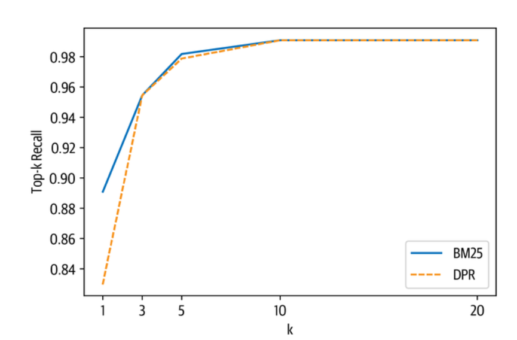

在这里我们可以看到，DPR并没有提供比BM25更高的召回率，并且在k=3左右达到饱和。

**技巧**

通过使用Facebook的FAISS库作为文档存储，可以加快执行嵌入的相似性搜索。同样，DPR检索器的性能也可以通过对目标域进行微调来提高。如果你想了解如何对DPR进行微调，请查看Haystack的教程。

现在我们已经探讨了对检索器的评价，让我们转向对读者的评价。

### 评估阅读器


在抽取式问答系统中，有两个主要的指标用于评价阅读器：

**完全匹配（EM）**

一个二进制指标，如果预测答案和地面真实答案中的字符完全匹配，则EM=1，否则EM=0。如果没有预期的答案，如果模型预测了任何文本，则EM=0。
**F1-score** 

衡量精度和召回率的谐波平均值。

让我们通过从FARM中导入一些辅助函数并将其应用于一个简单的例子，来看看这些指标是如何工作的：

```
from farm.evaluation.squad_evaluation import compute_f1, compute_exact 
pred = "about 6000 hours" 
label = "6000 hours" 
print(f"EM: {compute_exact(label, pred)}") 
print(f"F1: {compute_f1(label, pred)}")

EM: 0 
F1: 0.8

```

在引擎盖下，这些函数首先通过去除标点符号、修正空白和转换为小写字母来规范预测和标签。然后，规范化的字符串被标记为一个词包，最后再计算标记层面的度量。从这个简单的例子中，我们可以看到EM是一个比F-score更严格的指标：在预测中增加一个标记，EM就为零。另一方面，F-score可能无法捕捉到真正不正确的答案。例如，如果我们预测的答案跨度是 "大约6000美元"，那么我们会得到：

```
pred = "about 6000 dollars" 
print(f"EM: {compute_exact(label, pred)}") 
print(f"F1: {compute_f1(label, pred)}") 

EM: 0 
F1: 0.4

```

因此，仅仅依靠F-score是有误导性的，跟踪这两个指标是一个很好的策略，可以平衡低估（EM）和高估（F-score）模型性能之间的权衡。

现在，一般来说，每个问题都有多个有效的答案，所以这些指标是针对评价集中的每个问题-答案对进行计算的，并在所有可能的答案中选择最佳分数。然后，通过对每个问题-答案对的单独得分进行平均，得到该模型的总体EM和F分数。

为了评估阅读器，我们将创建一个有两个节点的新流水线：一个阅读器节点和一个评估阅读器的节点。我们将使用EvalReader类，它从阅读器中获取预测结果，并计算出相应的EM和F分数。为了与SQuAD评估进行比较，我们将用存储在EvalAnswers中的top_1_em和top_1_f1指标来获取每个查询的最佳答案：

```
from haystack.eval import EvalAnswers 
def evaluate_reader(reader): 
	score_keys = ['top_1_em', 'top_1_f1'] 
	eval_reader = EvalAnswers(skip_incorrect_retrieval=False) 
	pipe = Pipeline() 
	pipe.add_node(component=reader, name="QAReader", inputs=["Query"]) 
	pipe.add_node(component=eval_reader, name="EvalReader", inputs= ["QAReader"]) 
	for l in labels_agg: 
		doc = document_store.query(l.question, filters={"question_id":[l.origin]}) _ = pipe.run(query=l.question, documents=doc, labels=l) 
	return {k:v for k,v in eval_reader.__dict__.items() if k in score_keys} 
reader_eval = {} 
reader_eval["Fine-tune on SQuAD"] = evaluate_reader(reader)

```

请注意，我们指定了 skip_incorrect_retrieval=False。这是为了确保检索器总是将上下文传递给阅读器（如SQuAD评估）。现在，我们已经通过阅读器运行了每一道题，让我们来打印分数：

```
def plot_reader_eval(reader_eval): 
	fig, ax = plt.subplots() 
	df = pd.DataFrame.from_dict(reader_eval) 
	df.plot(kind="bar", ylabel="Score", rot=0, ax=ax) ax.set_xticklabels(["EM", "F1"]) 
	plt.legend(loc='upper left') 
	plt.show() 

plot_reader_eval(reader_eval)

```

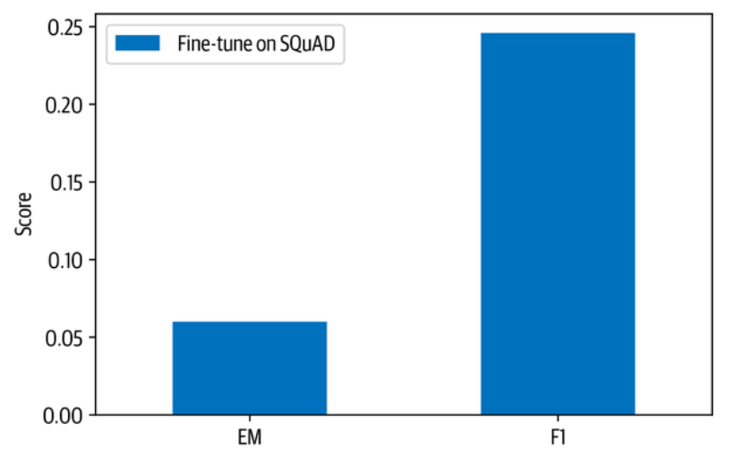

OK，看来微调模型在SubjQA上的表现明显不如在SQuAD 2.0上的表现，MiniLM在SQuAD 2.0上取得的EM和F分数分别为76.1和79.5。性能下降的原因之一是客户评论与SQuAD 2.0数据集所产生的维基百科文章有很大的不同，他们使用的语言往往是非正式的。另一个因素可能是我们的数据集固有的主观性，问题和答案都与维基百科中的事实信息不同。让我们来看看如何在数据集上微调模型，以获得更好的领域适应性结果。

#### 领域适应性

尽管在SQuAD上进行了微调的模型通常会很好地泛化到其他领域，但我们已经看到，对于SubjQA，我们模型的EM和F分数比SQuAD差得多。这种泛化失败的现象在其他抽取式QA数据集中也被观察到，并被理解为转化器模型特别善于对SQuAD过度拟合的证据。改善阅读器的最直接的方法是在SubjQA训练集上进一步微调我们的MiniLM模型。FARMReader有一个专门为此设计的train()方法，它希望数据是SQuAD的JSON格式，如图7-11所示，每个项目的所有问答对都被分组在一起。

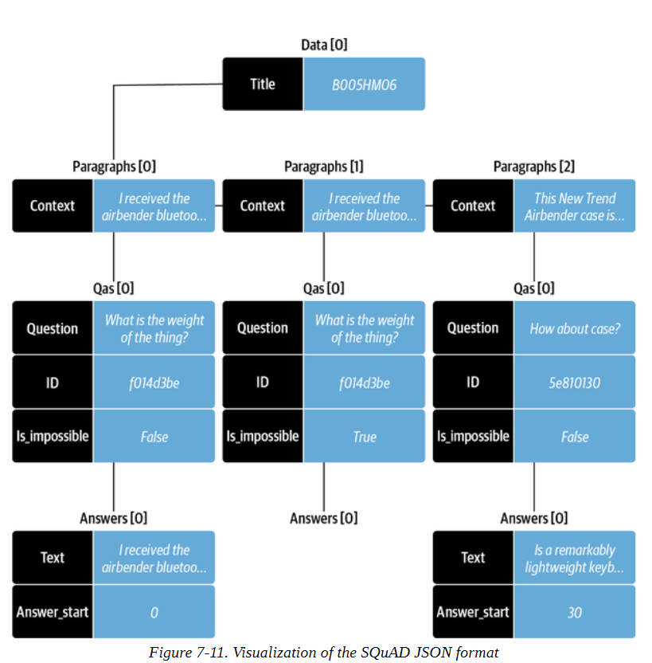

这是一个相当复杂的数据格式，所以我们需要一些函数和一些Pandas魔法来帮助我们完成转换。我们需要做的第一件事是实现一个函数，可以创建与每个产品ID相关的段落数组。这个数组中的每个元素都包含一个上下文（即评论）和一个问答对的qas数组。下面是一个建立段落数组的函数：

```
def create_paragraphs(df): 
	paragraphs = [] 
	id2context = dict(zip(df["review_id"], df["context"])) 
	for review_id, review in id2context.items():
		qas = [] 
		# Filter for all question-answer pairs about a specific context 
		review_df = df.query(f"review_id == '{review_id}'") 
		id2question = dict(zip(review_df["id"], review_df["question"])) 
		# Build up the qas array 
		for qid, question in id2question.items():
        	# Filter for a single question ID 
        	question_df = df.query(f"id == '{qid}'").to_dict(orient="list") 
        	ans_start_idxs = question_df["answers.answer_start"][0].tolist()
            ans_text = question_df["answers.text"][0].tolist() 
            # Fill answerable questions 
            if len(ans_start_idxs): 
            	answers = [ {"text": text, "answer_start": answer_start} for text, answer_start in zip(ans_text, ans_start_idxs)] 
            	is_impossible = False 
            else: 
            	answers = [] 
            	is_impossible = True 
            	# Add question-answer pairs to 
            qas qas.append({"question": question, "id": qid, "is_impossible": is_impossible, "answers": answers}) 
         # Add context and question-answer pairs to paragraphs 
       paragraphs.append({"qas": qas, "context": review}) 
   return paragraphs

```

现在，当我们应用于与单个产品ID相关的DataFrame的行时，我们得到了SQuAD格式:

```
product = dfs["train"].query("title == 'B00001P4ZH'") 
create_paragraphs(product) 

[{'qas': [{'question': 'How is the bass?', 'id': '2543d296da9766d8d17d040ecc781699', 'is_impossible': True, 'answers': []}], 'context': 'I have had Koss headphones ...', 'id': 'd476830bf9282e2b9033e2bb44bbb995', 'is_impossible': False, 'answers': [{'text': 'Bass is weak as expected', 'answer_start': 1302}, {'text': 'Bass is weak as expected, even with EQ adjusted up', 'answer_start': 1302}]}], 'context': 'To anyone who hasn\'t tried all ...'}, {'qas': [{'question': 'How is the bass?', 'id': '455575557886d6dfeea5aa19577e5de4','is_impossible': False, 'answers': [{'text': 'The only fault in the sound is the bass', 'answer_start': 650}]}], 'context': "I have had many sub-$100 headphones ..."}]

```

最后一步是将这个函数应用于每个分割的DataFrame中的每个产品ID。下面的convert_to_squad()函数做了这个技巧，并将结果存储在electronic-{split}.json文件中:

```
import json 
def convert_to_squad(dfs): 
	for split, df in dfs.items(): 
		subjqa_data = {} 
		# Create `paragraphs` for each product ID 
		groups = (df.groupby("title").apply(create_paragraphs) .to_frame(name="paragraphs").reset_index()) 
		subjqa_data["data"] = groups.to_dict(orient="records") 
		# Save the result to disk 
		with open(f"electronics-{split}.json", "w+", encoding="utf-8") as f: 
			json.dump(subjqa_data, f) 
			
convert_to_squad(dfs)

```

现在我们有了正确格式的分片，让我们通过指定训练和设计分片的位置，以及保存微调后的模型的位置来微调我们的读者:

```
train_filename = "electronics-train.json" 
dev_filename = "electronics-validation.json" 
reader.train(data_dir=".", use_gpu=True, n_epochs=1, batch_size=16, train_filename=train_filename, dev_filename=dev_filename)

```

在对阅读器进行微调后，现在让我们将其在测试集上的表现与我们的基线模型进行比较:

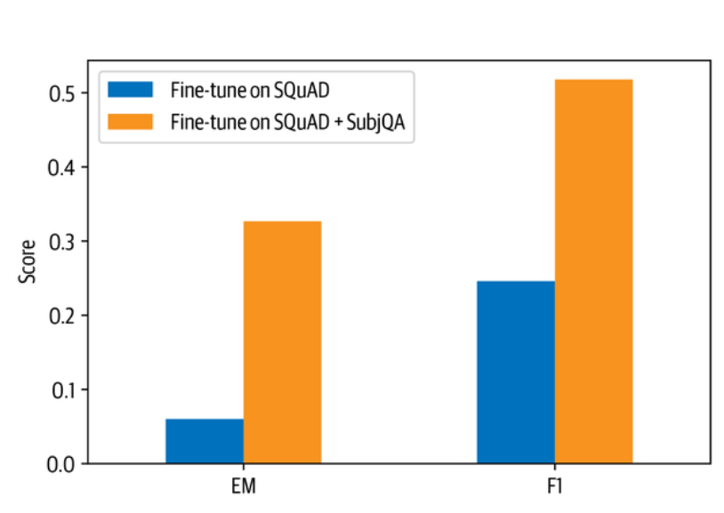

哇，领域适应性使我们的EM得分增加了6倍，F-score增加了一倍以上 在这一点上，你可能会想，为什么我们不直接在SubjQA训练集上对预训练的语言模型进行微调。其中一个原因是，我们在SubjQA中只有1295个训练实例，而SQuAD有超过10万个，所以我们可能会遇到过度拟合的挑战。尽管如此，让我们来看看天真的微调会产生什么。为了进行公平的比较，我们将使用在SQuAD上用于微调基线的同一语言模型。和以前一样，我们将用FARMReader加载模型:

```
minilm_ckpt = "microsoft/MiniLM-L12-H384-uncased" 
minilm_reader = FARMReader(model_name_or_path=minilm_ckpt, progress_bar=False, max_seq_len=max_seq_length, doc_stride=doc_stride, return_no_answer=True)

```

接下来，我们对一个epoch进行微调:

```
minilm_reader.train(data_dir=".", use_gpu=True, n_epochs=1, batch_size=16, train_filename=train_filename, dev_filename=dev_filename)

```

并包括对测试集的评估:

```
reader_eval["Fine-tune on SubjQA"] = evaluate_reader(minilm_reader) 

plot_reader_eval(reader_eval)

```

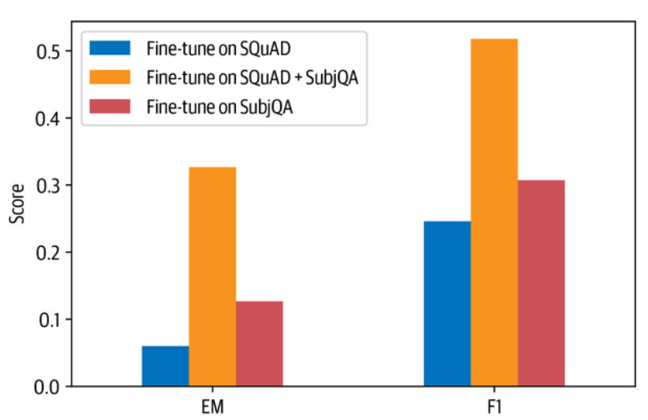

我们可以看到，直接在SubjQA上对语言模型进行微调的结果比在SQuAD和SubjQA上进行微调的结果差很多。


**警告**

在处理小数据集时，最好的做法是在评估Transformers时使用交叉验证，因为它们可能容易过度拟合。你可以在FARM资源库中找到一个关于如何使用SQuAD格式的数据集进行交叉验证的例子。

### 评估整个QA流水线

现在我们已经看到了如何单独评估阅读器和检索器组件，让我们把它们联系起来，以衡量我们流水线的整体性能。要做到这一点，我们需要在检索器流水线中增加读取器和其评估的节点。我们已经看到，我们在k=10时得到了几乎完美的召回，所以我们可以固定这个值，并评估这对阅读器性能的影响（因为与SQuAD式的评估相比，它现在会在每个查询中收到多个上下文）：

```
# Initialize retriever pipeline 
pipe = EvalRetrieverPipeline(es_retriever) 
# Add nodes for reader 
eval_reader = EvalAnswers() 
pipe.pipeline.add_node(component=reader, name="QAReader", inputs=["EvalRetriever"])
pipe.pipeline.add_node(component=eval_reader, name="EvalReader", inputs=["QAReader"]) 
# Evaluate! 
run_pipeline(pipe) 
# Extract metrics from reader 
reader_eval["QA Pipeline (top-1)"] = { k:v for k,v in eval_reader.__dict__.items() if k in ["top_1_em", "top_1_f1"]}

```

然后我们可以在图7-12中比较该模型在检索器返回的文档中预测答案的前1个EM和F-Score。

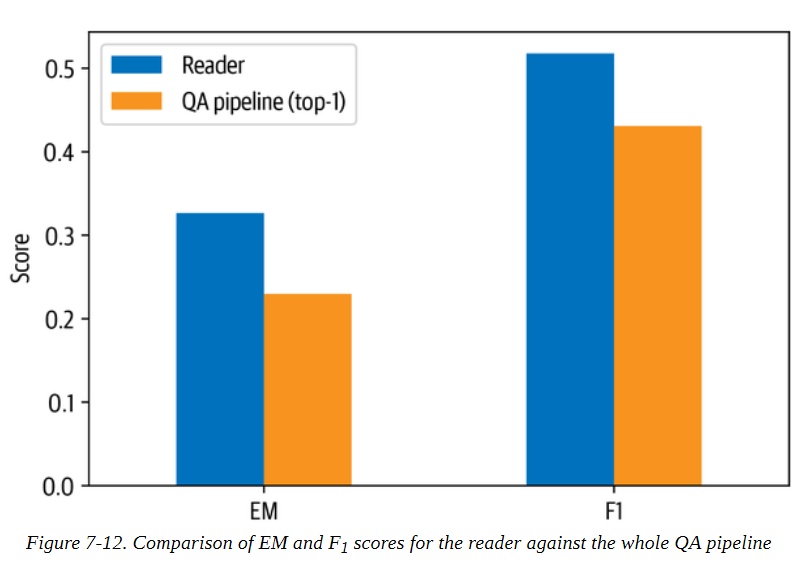

从这个图中我们可以看到检索器对整体性能的影响。特别是，与匹配问题-语境对相比，整体性能有所下降，就像在SQuAD式评估中所做的那样。这可以通过增加允许读者预测的可能答案的数量来规避。

到目前为止，我们只从上下文中提取了答案的跨度，但在一般情况下，答案的碎片可能散落在整个文档中，我们希望我们的模型能够将这些碎片综合成一个连贯的答案。让我们来看看我们如何使用生成式问答系统来成功完成这项任务。

## 超越抽取式QA

一个有趣的替代方法是用预先训练好的语言模型来生成答案，而不是把答案作为文件中的跨段文字来提取。这种方法通常被称为抽象性或生成性QA，并且有可能产生更好的、综合了多个段落证据的答案。虽然没有抽取式问答那么成熟，但这是一个快速发展的研究领域，所以当你读到这篇文章的时候，这些方法有可能已经在行业中被广泛采用了。在这一节中，我们将简要地谈一谈当前的技术水平：检索-增强生成（RAG）。

RAG扩展了我们在本章中看到的经典检索器-阅读器架构，将阅读器换成了生成器，并使用DPR作为检索器。生成器是一个预先训练好的序列到序列的转化器，比如T5或BART，它从DPR接收文档的潜伏向量，然后根据查询和这些文档迭代生成一个答案。由于DPR和生成器是可区分的，整个过程可以进行端到端的微调，如图7-13所示。

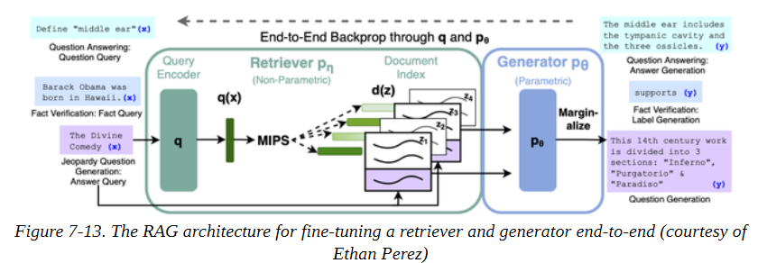

为了展示RAG的运作，我们将使用前面的DPRetriever，所以我们只需要实例化一个生成器。有两种类型的RAG模型可供选择:

**RAG-Sequence**

 使用同一检索到的文件来生成完整的答案。特别是，来自检索器的前k个文档被送入生成器，生成器为每个文档产生一个输出序列，结果被边缘化以获得最佳答案。

**RAG-Token** 

可以使用不同的文档来生成答案中的每个标记。这使得生成器能够综合来自多个文档的证据。

由于RAG-Token模型往往比RAG-Sequence模型表现更好，我们将使用在NQ上微调过的token模型作为我们的生成器。在Haystack中实例化一个生成器类似于实例化阅读器，但我们不是为上下文的滑动窗口指定max_seq_length和doc_stride参数，而是指定控制文本生成的超级参数:

```
from haystack.generator.transformers import RAGenerator 
generator = RAGenerator(model_name_or_path="facebook/rag-token-nq", embed_title=False, num_beams=5)

```

这里num_beams指定了在波束搜索中使用的波束数量（文本生成在第五章有详细介绍）。正如我们对DPR检索器所做的那样，我们不嵌入文件标题，因为我们的语料库总是按产品ID进行过滤。

接下来要做的是使用Haystack的GenerativeQAPipeline将检索器和生成器联系起来:

```
from haystack.pipeline import GenerativeQAPipeline
pipe = GenerativeQAPipeline(generator=generator, retriever=dpr_retriever)

```


**注意事项**

在RAG中，查询编码器和生成器都是端到端的训练，而上下文编码器是冻结的。在Haystack中，生成式QAPipeline使用RAGenerator的查询编码器和DensePassageRetriever的上下文编码器。


现在让我们给RAG来个旋转，输入之前关于亚马逊Fire平板电脑的一些查询。为了简化查询，我们将编写一个简单的函数，接受查询并打印出最重要的答案：

```
def generate_answers(query, top_k_generator=3): 
	preds = pipe.run(query=query, top_k_generator=top_k_generator, top_k_retriever=5, filters={"item_id":["B0074BW614"]}) 
	print(f"Question: {preds['query']} \n") 
	for idx in range(top_k_generator): 
		print(f"Answer {idx+1}: {preds['answers'][idx]['answer']}")

```

好了，现在我们准备给它做个测试：

```
generate_answers(query) 

Question: Is it good for reading? 
Answer 1: the screen is absolutely beautiful 
Answer 2: the Screen is absolutely beautiful 
Answer 3: Kindle fire

```

这个结果对于一个答案来说不算太坏，但它确实表明，问题的主观性使生成器感到困惑。让我们用更符合事实的东西来试试：

```
generate_answers("What is the main drawback?") 
Question: What is the main drawback?
Answer 1: the price 
Answer 2: no flash support
Answer 3: the cost

```

这是更合理的! 为了得到更好的结果，我们可以在SubjQA上对RAG进行端到端的微调；我们将此作为一个练习，但如果你有兴趣探索它，在Transformers资源库中有一些脚本可以帮助你开始。

## 小结


好了，这就是一次关于问答系统的旋风之旅，你可能还有很多问题想得到解答（双关语）。在本章中，我们讨论了两种问答系统方法（抽取式和生成式），并研究了两种不同的检索算法（BM25和DPR）。一路走来，我们看到领域适应可以是一种简单的技术，可以将我们的QA系统的性能大大提升，我们还看了一些用于评估此类系统的最常用指标。尽管我们关注的是封闭领域的QA（即单一领域的电子产品），但本章中的技术可以很容易地推广到开放领域的情况；我们建议阅读Cloudera优秀的Fast Forward QA系列来了解其中的内容。在野外部署QA系统是一件很棘手的事情，我们的经验是，价值的很大一部分来自于首先为终端用户提供有用的搜索功能，然后再提供提取组件。在这方面，除了回答用户的按需查询外，阅读器还可以以新颖的方式使用。例如，Grid Dynamics的研究人员能够使用他们的阅读器自动提取客户目录中每个产品的一组优点和缺点。他们还表明，阅读器可以通过创建像 "什么类型的相机 "这样的查询，以零距离的方式提取命名实体。考虑到它的起步阶段和微妙的失败模式，我们建议只有在其他两种方法都用尽之后才去探索生成式问答系统。图7-14说明了处理问答系统问题的 "需求层次"。

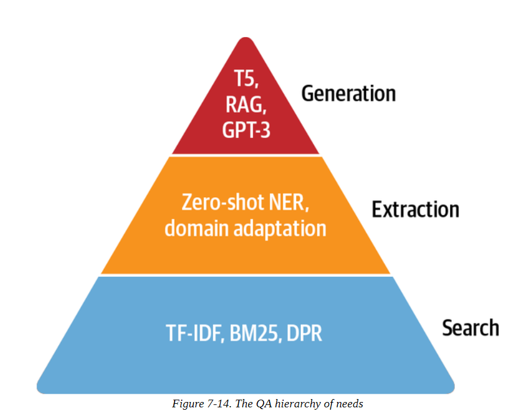

展望未来，一个令人兴奋的研究领域是多模态问答系统，这涉及到对多种模态的问答系统，如文本、表格和图像。正如MultiModalQA基准所描述的那样，这样的系统可以使用户回答整合不同模式信息的复杂问题，比如 "那幅有两个手指接触的名画是什么时候完成的？" 另一个具有实际商业应用的领域是知识图谱上的问答系统，图谱的节点对应于现实世界的实体，它们的关系由边来定义。通过将事实编码为（主语、谓语、宾语）三要素，人们可以使用该图来回答有关缺失元素的问题。关于一个将转化器和知识图谱结合起来的例子，请看Haystack教程。一个更有前途的方向是自动生成问题，作为使用未标记的数据或数据增强进行某种形式的无监督/弱监督训练的方法。最近的两个例子包括关于 "可能回答的问题"（PAQ）基准和跨语言设置的合成数据增强的论文。

在本章中我们看到，为了成功地将QA模型用于现实世界的用例，我们需要应用一些技巧，比如实施快速的检索流水线，以接近实时的方式进行预测。不过，在生产硬件上，将QA模型应用于少数预选的文档可能需要几秒钟的时间。虽然这听起来不多，但想象一下，如果你不得不等待几秒钟才能得到谷歌搜索的结果，你的体验会有多大不同--几秒钟的等待时间可以决定你的由Transformers驱动的应用程序的命运。在下一章中，我们将看一下进一步加速模型预测的一些方法。
